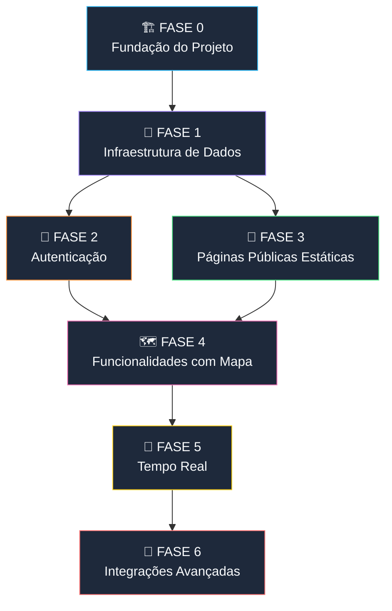

# 🗺️ ROADMAP DE IMPLEMENTAÇÃO — Cadê o Lixeiro? v2.0

> **Documento Mestre de Acompanhamento**
> **Última atualização:** 24/05/2026
> **Status global:** 🟡 FASE 0 em andamento

---

## Visão Geral do Planejamento

O desenvolvimento está dividido em **7 fases sequenciais**, organizadas por dependência técnica. Cada fase só deve iniciar quando a anterior estiver concluída. Dentro de cada fase, as tarefas podem ser desenvolvidas em paralelo quando indicado.

### Grafo de Dependências



---

## Legenda de Status

| Símbolo | Significado |
|:-------:|-------------|
| `[ ]` | Não iniciado |
| `[/]` | Em andamento |
| `[x]` | Concluído |
| `[!]` | Bloqueado / Requer ação |
| 📋 | Referência a SRS |
| 📐 | Referência a SDD |
| 🔗 | Dependência de outra tarefa |
| ⚡ | Pode ser feito em paralelo |

---

## FASE 0 — Fundação do Projeto 🏗️

> **Objetivo:** Criar a estrutura do monorepo, configurar ferramentas e garantir que o ambiente de desenvolvimento funciona end-to-end.
> **Estimativa:** 1-2 dias
> **Dependências:** Nenhuma
> **Specs de referência:** [SDD README](./sdd/README.md) (seção "Estrutura do Monorepo")

### 0.1 — Setup do Monorepo

- [x] Criar estrutura de pastas `frontend/`, `backend/`, `supabase/`
- [x] Criar `.gitignore` para Python, Node, SvelteKit, e `.env`
- [x] Criar `README.md` do projeto com instruções de setup

### 0.2 — Setup Frontend (SvelteKit + Tailwind v4)

- [x] Inicializar SvelteKit via `npx sv create` (Svelte 5, TypeScript, adapter-static)
- [x] Instalar e configurar Tailwind CSS v4
- [x] Instalar dependências base: `@supabase/supabase-js`, `leaflet`
- [x] Criar `frontend/.env.example` com variáveis: `PUBLIC_SUPABASE_URL`, `PUBLIC_SUPABASE_ANON_KEY`, `PUBLIC_API_URL`
- [x] Configurar `svelte.config.js` com adapter-static
- [x] Criar layout base (`+layout.svelte`) com header/footer/navegação
- [x] Verificar: `npm run build` compila sem erros

### 0.3 — Setup Backend (FastAPI + SQLAlchemy)

- [x] Criar `backend/requirements.txt` com dependências:
  ```
  fastapi[standard]
  uvicorn[standard]
  sqlalchemy[asyncio]
  asyncpg
  geoalchemy2
  python-jose[cryptography]
  httpx
  sqladmin
  pywebpush
  python-dotenv
  ```
- [x] Criar `backend/app/main.py` com app FastAPI básico + CORS configurado
- [x] Criar `backend/app/config.py` com settings via Pydantic
- [x] Criar `backend/app/database.py` com engine async SQLAlchemy + session maker
- [x] Criar `backend/app/dependencies.py` com `get_db` e `get_current_user`
- [x] Criar `backend/.env.example` com variáveis: `DATABASE_URL`, `SUPABASE_URL`, `SUPABASE_SERVICE_KEY`, `JWT_SECRET`
- [x] Criar `backend/Dockerfile` para deploy no Railway
- [x] Verificar: `uvicorn app.main:app` funciona e retorna `{"status": "ok"}` em `/health` ✅

### 0.4 — Setup Supabase

- [x] Criar projeto no Supabase Dashboard
- [ ] Instalar Supabase CLI localmente
- [ ] Inicializar `supabase init` na raiz do projeto
- [x] Habilitar extensão **PostGIS** no Supabase Dashboard (v3.3)
- [x] Configurar variáveis de ambiente nos `.env` (frontend e backend)
- [x] Verificar: conexão do backend com o PostgreSQL Supabase funciona ✅ (Pooler IPv4)
- [ ] Verificar: conexão do frontend com Supabase Auth funciona

### 0.5 — Design System Base

- [x] Configurar paleta de cores no Tailwind (tema "sustentabilidade": verdes, azuis, terra)
- [x] Instalar e configurar fonte do Google Fonts (Inter ou Outfit)
- [x] Criar componentes UI base: `Button.svelte`, `Input.svelte`, `Toast.svelte`, `Badge.svelte`
- [x] Criar `frontend/src/lib/components/Layout/Header.svelte` com navegação
- [x] Criar `frontend/src/lib/components/Layout/Footer.svelte`
- [ ] Verificar: navegação entre rotas funciona com layout responsivo

---

## FASE 1 — Infraestrutura de Dados 🧱 ✅

> **Objetivo:** Criar todas as tabelas do banco, migrations, models SQLAlchemy, e o endpoint `/api/bairros` que é pré-requisito de quase tudo.
> **Estimativa:** 2-3 dias
> **Dependências:** 🔗 FASE 0 concluída
> **Specs de referência:** Todos os SDDs (seção "Modelagem de Dados")

### 1.1 — Migration: Tabelas Base

- [x] Criar migration `001_tabelas_base.sql`:
  - [x] Tabela `bairros` — 📐 [DSC-1 SDD §3.3](./sdd/DSC-1-Locais-de-Descarte.md)
  - [x] Tabela `caminhoes` — 📐 [RAT-1 SDD §3.2](./sdd/RAT-1-Rastreamento-Cidadao.md)
  - [x] Tabela `motoristas` — 📐 [AUT-1 SDD §3.1](./sdd/AUT-1-Login-Motorista.md)
  - [x] Tabela `rotas` — 📐 [HOR-1 SDD §3.1](./sdd/HOR-1-Horarios-de-Passagem.md)
  - [x] Tabela `pontos_rota` — 📐 [HOR-1 SDD §3.2](./sdd/HOR-1-Horarios-de-Passagem.md)
- [x] Aplicar migration via MCP `execute_sql`

### 1.2 — Migration: Tabelas de Funcionalidades

- [x] Criar migration `002_funcionalidades.sql`:
  - [x] Tabela `locais_descarte` — 📐 [DSC-1 SDD §3.1](./sdd/DSC-1-Locais-de-Descarte.md)
  - [x] Tabela `avaliacoes_descarte` — 📐 [DSC-1 SDD §3.2](./sdd/DSC-1-Locais-de-Descarte.md)
  - [x] Tabela `localizacoes_caminhao` — 📐 [RAT-1 SDD §3.1](./sdd/RAT-1-Rastreamento-Cidadao.md)
  - [x] Tabela `cache_geocodificacao` — 📐 [RAT-2 SDD §3.1](./sdd/RAT-2-Compartilhamento-Localizacao.md)
  - [x] Tabela `denuncias` + `timeline_status` — 📐 [DEN-1 SDD §3.1-3.2](./sdd/DEN-1-Denuncias.md)
  - [x] Sequência `seq_denuncia_id` — 📐 [DEN-1 SDD §3.1](./sdd/DEN-1-Denuncias.md)
  - [x] Tabela `subscriptions_push` + `log_notificacoes` — 📐 [NOT-1 SDD §3.1-3.2](./sdd/NOT-1-Notificacoes-Push.md)
- [x] Aplicar migration via MCP `execute_sql`

### 1.3 — Migration: Views e Índices

- [x] Criar migration `003_views_indices.sql`:
  - [x] Materialized View `mv_ranking_mensal` — 📐 [GAM-1 SDD §3.1](./sdd/GAM-1-Ranking-de-Bairros.md)
  - [x] Índices GiST para PostGIS — 📐 [DSC-1 SDD §3.3](./sdd/DSC-1-Locais-de-Descarte.md)
  - [x] Índices GIN para arrays — 📐 [DSC-1 SDD §3.1](./sdd/DSC-1-Locais-de-Descarte.md)
- [x] Aplicar migration

### 1.4 — Migration: RLS (Row Level Security)

- [x] Criar migration `004_rls.sql`:
  - [x] Policies para tabelas públicas (SELECT para `anon`)
  - [x] Policies para tabelas protegidas (SELECT/INSERT para `authenticated`)
  - [x] Policies para `service_role` (ALL — bypass nativo)
- [x] Aplicar e testar RLS

### 1.5 — Models SQLAlchemy (Backend)

- [x] Criar `backend/app/models/__init__.py` com imports (13 models)
- [x] Criar `backend/app/models/bairro.py` — Model `Bairro` com `geom` GeoAlchemy2
- [x] Criar `backend/app/models/caminhao.py` — Model `Caminhao`
- [x] Criar `backend/app/models/motorista.py` — Model `Motorista`
- [x] Criar `backend/app/models/rota.py` — Model `Rota` + `PontoRota`
- [x] Criar `backend/app/models/local_descarte.py` — Model `LocalDescarte` + `AvaliacaoDescarte`
- [x] Criar `backend/app/models/localizacao.py` — Model `LocalizacaoCaminhao` + `CacheGeocodificacao`
- [x] Criar `backend/app/models/denuncia.py` — Model `Denuncia` + `TimelineStatus`
- [x] Criar `backend/app/models/notificacao.py` — Model `SubscriptionPush` + `LogNotificacao`
- [x] Verificar: todos os 13 models importam sem erros ✅

### 1.6 — Endpoint `/api/bairros` + Seed de Dados

- [x] Criar `backend/app/routers/bairros.py` — `GET /api/bairros`
- [x] Registrar router no `main.py`
- [x] Criar `supabase/seed/001_bairros.sql` com bairros de Manaus (63 bairros)
- [x] Aplicar seed (63 bairros inseridos)
- [x] Verificar: `GET /api/bairros` retorna 63 bairros ✅

### 1.7 — Supabase Storage

- [x] Criar bucket `denuncias` no Supabase Storage
- [x] Configurar políticas de acesso:
  - [x] Upload: público (anônimo + authenticated)
  - [x] Download: público
  - [x] Limite: 5MB por arquivo (JPG/PNG/WEBP)
- [ ] Verificar: upload de teste funciona via API

---

## FASE 2 — Autenticação 🔐 ✅

> **Objetivo:** Implementar login/logout do motorista, validação de perfil e guard de rotas protegidas.
> **Estimativa:** 2-3 dias
> **Dependências:** 🔗 FASE 1.1 (tabelas `motoristas`, `caminhoes`)
> **Specs de referência:**
> - 📋 [AUT-1 SRS](./srs/AUT-1-Login-Motorista.md) + 📐 [AUT-1 SDD](./sdd/AUT-1-Login-Motorista.md)
> - 📋 [AUT-2 SRS](./srs/AUT-2-Logout.md) + 📐 [AUT-2 SDD](./sdd/AUT-2-Logout.md)

### 2.1 — Utilitários de CPF (Frontend)

- [x] Criar `frontend/src/lib/utils/cpf.ts`:
  - [x] Função `validarCPF()` — validação de dígitos verificadores
  - [x] Função `cpfToEmail()` — `{CPF}@cadeolixeiro.internal`
  - [x] Função `mascaraCPF()` — formatação visual `000.000.000-00`
- [x] Referência: 📐 [AUT-1 SDD §4.1](./sdd/AUT-1-Login-Motorista.md)

### 2.2 — Client Supabase (Frontend)

- [x] Criar `frontend/src/lib/supabase.ts` — singleton do client
- [x] Criar `frontend/src/lib/stores/auth.svelte.ts` — rune store com `$state`:
  - [x] Estado `usuario` (null ou dados do motorista)
  - [x] Função `login(cpf, senha)`
  - [x] Função `logout()`
  - [x] Listener `onAuthStateChange` para refresh automático
- [x] Referência: 📐 [AUT-1 SDD §4.2](./sdd/AUT-1-Login-Motorista.md)

### 2.3 — Endpoint de Validação de Perfil (Backend)

- [x] Criar `backend/app/routers/auth.py`:
  - [x] `GET /api/auth/validar-perfil` — verifica motorista ativo + caminhão
- [x] Implementar `get_current_user` em `dependencies.py` (JWKS ES256 + HS256 fallback)
- [x] Registrar router no `main.py`
- [x] Referência: 📐 [AUT-1 SDD §4.3](./sdd/AUT-1-Login-Motorista.md)

### 2.4 — Componente de Login (Frontend)

- [x] Criar componente/modal de login com:
  - [x] Campo CPF com máscara automática
  - [x] Campo Senha mascarado com toggle de visibilidade
  - [x] Botão "Entrar" com spinner de loading
  - [x] Mensagens de erro por cenário (CPF inválido, credenciais, inativo, sem veículo)
- [x] Integrar com `auth.svelte.ts` → Supabase Auth → FastAPI
- [x] Referência: 📋 [AUT-1 SRS §5](./srs/AUT-1-Login-Motorista.md)

### 2.5 — Guard de Rotas Protegidas

- [x] Criar `frontend/src/routes/coletor/+page.svelte` — UI condicional (login se não auth, painel se auth)
- [ ] Criar `frontend/src/routes/admin/+layout.ts` — verifica role `admin` (será feito na FASE Admin)
- [x] Referência: 📐 [AUT-1 SDD §9 (decisão 4)](./sdd/AUT-1-Login-Motorista.md)

### 2.6 — Logout

- [x] Implementar `logout()` em `auth.svelte.ts`:
  - [x] Parar rastreamento (GPS + WebSocket) — placeholder, será integrado na FASE 5
  - [x] `supabase.auth.signOut()`
  - [x] Limpar localStorage/sessionStorage
  - [x] `goto('/')`
- [x] Adicionar botão "Sair" no header (visível apenas quando autenticado)
- [x] Referência: 📐 [AUT-2 SDD §4.1](./sdd/AUT-2-Logout.md)

### 2.7 — Seed de Teste: Motorista + Caminhão

- [x] Criar usuário de teste no Supabase Auth via Admin API: `12345678909@cadeolixeiro.internal` / `teste123`
- [x] Inserir registro na tabela `caminhoes`: `{truck_id: "CAM-001", modelo: "VW Constellation 17.280", placa: "OAM-0001"}`
- [x] Inserir registro na tabela `motoristas`: vinculado ao auth_id e caminhao_id
- [x] Verificar: fluxo completo Login → validar-perfil → perfil retornado ✅

---

## FASE 3 — Páginas Públicas Estáticas 📄 ✅

> **Objetivo:** Implementar funcionalidades que não dependem de autenticação e têm baixa complexidade técnica.
> **Estimativa:** 2-3 dias
> **Dependências:** 🔗 FASE 0 (frontend rodando) + 🔗 FASE 1.6 (endpoint `/api/bairros`)
> **Nota:** ⚡ Pode ser feita em paralelo com a FASE 2

### 3.1 — Página Sobre (`/sobre`) — INF-1

- [x] Criar `frontend/src/routes/sobre/+page.svelte`
- [x] Implementar seções: Missão, Funcionalidades, Equipe, Stack, Contato
- [x] Adicionar meta tags SEO (`<svelte:head>`)
- [x] Adicionar link para GitHub do projeto
- [x] Verificar: responsividade mobile + desktop ✅
- [x] **Referências:**
  - 📋 [INF-1 SRS](./srs/INF-1-Pagina-Sobre.md)
  - 📐 [INF-1 SDD](./sdd/INF-1-Pagina-Sobre.md)

### 3.2 — Página Ranking (`/ranking`) — GAM-1

- [x] Criar `backend/app/routers/ranking.py`:
  - [x] `GET /api/ranking?periodo=mensal|acumulado`
  - [x] `GET /api/ranking/top3`
- [x] Criar `frontend/src/lib/components/TabelaRanking.svelte`
- [x] Criar `frontend/src/lib/components/WidgetTop3.svelte` (medalhas 🥇🥈🥉)
- [x] Criar `frontend/src/routes/ranking/+page.svelte`
- [x] Integrar widget Top 3 na página inicial (`+page.svelte`)
- [x] Verificar: ranking exibe 63 bairros (todos com 0 pts — esperado sem dados) ✅
- [x] **Referências:**
  - 📋 [GAM-1 SRS](./srs/GAM-1-Ranking-de-Bairros.md)
  - 📐 [GAM-1 SDD](./sdd/GAM-1-Ranking-de-Bairros.md)

---

## FASE 4 — Funcionalidades com Mapa 🗺️ ✅

> **Objetivo:** Implementar as telas que usam Leaflet.js com dados do banco — locais de descarte, horários de passagem e denúncias.
> **Estimativa:** 5-7 dias
> **Dependências:** 🔗 FASE 1 (todas as tabelas) + 🔗 FASE 3.1 (layout pronto)

### 4.1 — Componente Mapa Reutilizável

- [x] Criar `frontend/src/lib/components/Mapa/MapaBase.svelte`:
  - [x] Inicialização Leaflet com tile layer
  - [x] Centralização em Manaus por padrão
  - [x] Suporte a GPS do cidadão (marcador azul animado)
  - [x] Callback onMapReady para marcadores customizados
- [x] Verificar: mapa renderiza sem erros ✅

### 4.2 — Locais de Descarte (`/descarte`) — DSC-1

- [x] Criar `backend/app/routers/descarte.py`:
  - [x] `GET /api/descarte?bairro_id=&tipo=&busca=` — lista filtrada (7 locais) ✅
  - [x] `POST /api/descarte/{id}/avaliacao` — avaliação anônima com rate limit
  - [x] `GET /api/descarte/{id}/avaliacoes` — listar avaliações paginadas
- [x] Criar `frontend/src/lib/components/FiltrosDescarte.svelte`
- [x] Criar `frontend/src/lib/components/CardLocalDescarte.svelte`
- [x] Criar `frontend/src/routes/descarte/+page.svelte`
- [x] Implementar fitBounds ao filtrar ✅
- [x] Seed: 7 locais de descarte em bairros diferentes ✅

### 4.3 — Horários de Passagem (`/horarios`) — HOR-1

- [x] Criar `backend/app/routers/rotas.py`:
  - [x] `POST /api/rotas/por-bairro` — busca rotas por bairro_ids (1 rota Centro) ✅
  - [x] `GET /api/rotas/{rota_id}/pontos` — pontos com horários (6 pontos ROT-001) ✅
- [x] Criar `frontend/src/lib/components/ChipsBairros.svelte`
- [x] Criar `frontend/src/lib/components/TabelaRotas.svelte`
- [x] Criar `frontend/src/routes/horarios/+page.svelte`
- [x] Implementar: polyline + marcadores numerados no mapa ✅
- [x] Seed: 3 rotas com 11 pontos total ✅

### 4.4 — Denúncias (`/denunciar`) — DEN-1

- [x] Criar `backend/app/routers/denuncias.py`:
  - [x] `POST /api/denuncias` — multipart/form-data com fotos
  - [x] `GET /api/denuncias/{id_acompanhamento}` — consultar status + timeline
- [x] Criar `frontend/src/lib/components/UploadFotos.svelte` (preview, validação 5MB, JPG/PNG/WEBP)
- [x] Criar `frontend/src/lib/components/ConsultaStatus.svelte` (busca + timeline)
- [x] Criar `frontend/src/routes/denunciar/+page.svelte`
- [x] Implementar marcador arrastável no mapa (GPS + ajuste manual) ✅
- [x] Implementar detecção de bairro via PostGIS (ST_Contains) ✅
- [x] Implementar ID de acompanhamento: `DEN-YYYY-NNNNN` (sequência criada) ✅
- [x] Implementar rate limit por IP (max 5/24h) ✅

---

## FASE 5 — Tempo Real (WebSocket + GPS) 📡 ✅

> **Objetivo:** Implementar o coração do sistema — rastreamento em tempo real, compartilhamento de localização do motorista, e visualização da rota de coleta.
> **Estimativa:** 5-7 dias
> **Dependências:** 🔗 FASE 2 (autenticação funcional) + 🔗 FASE 4.1 (mapa base)

### 5.1 — WebSocket Hub (Backend)

- [x] `backend/app/websockets/manager.py` — `ConnectionManager`:
  - [x] Gerenciamento de conexões cidadão (públicas) ✅
  - [x] Gerenciamento de conexões motorista (autenticadas) ✅
  - [x] Broadcast de posições ✅
  - [x] Limpeza de conexões mortas ✅
  - [x] Anti-spam 3s por truck_id ✅

### 5.2 — WebSocket do Cidadão (Backend)

- [x] `backend/app/websockets/tracking_hub.py` ✅
  - [x] Endpoint `ws://api/ws/tracking` (testado — estado_inicial + ping/pong)
  - [x] Registrado no `main.py` ✅

### 5.3 — WebSocket do Motorista (Backend)

- [x] `backend/app/websockets/driver_hub.py` ✅
  - [x] Endpoint `ws://api/ws/driver/{truck_id}` (rejeita sem JWT — 403)
  - [x] JWT validation (ES256 JWKS + HS256 fallback)
  - [x] Receber posições → persistir async → broadcast
  - [x] Handler `desconectar` → marcar offline
  - [x] Geocodificação assíncrona via `create_task`

### 5.4 — Geocodificação Assíncrona (Backend)

- [x] `backend/app/services/geocodificacao.py` ✅
  - [x] Cache PostGIS `ST_DWithin` (50m) com GIST index
  - [x] Nominatim fallback (pt-BR, timeout 5s)
  - [x] Salva no cache após resolução
  - [x] `geocodificar_e_atualizar()` como asyncio.create_task
- [x] Tabela `cache_geocodificacao` criada ✅

### 5.5 — Rastreamento na Página Inicial (Frontend)

- [x] `frontend/src/lib/stores/tracking.svelte.ts` ✅
  - [x] Reconexão automática (5s, max 10 tentativas)
  - [x] Estado reativo `caminhoes` (Map), `conectado` (boolean)
  - [x] Ping keep-alive 30s
  - [x] Filtro local por bairro
- [x] `MapaRastreamento.svelte` (marcadores animados, online/offline) ✅
- [x] `LegendaCaminhoes.svelte` (sidebar com lista de caminhões) ✅
- [x] `IndicadorConexao.svelte` (badge com ping animado) ✅
- [x] `+page.svelte` atualizada com mapa + legenda + indicador ✅

### 5.6 — Compartilhamento de Localização (Frontend)

- [x] `iniciarColeta(truckId, token)` + `pararColeta()` no store ✅
  - [x] `watchPosition` + WebSocket autenticado
  - [x] `clearWatch` + mensagem desconectar + fechar WS
- [x] `/coletor/+page.svelte` atualizada ✅
  - [x] Botão Iniciar/Encerrar Coleta funcional
  - [x] Cards: Coleta, Veículo, Rota
  - [x] Mapa com posição GPS + rota

### 5.7 — Rota de Coleta do Motorista

- [x] `GET /api/rotas/minha-rota` (autenticado) ✅
  - [x] Busca caminhão → rotas → pontos
- [x] Rota desenhada no mapa com marcadores numerados ✅
- [x] Lista de pontos clicável (zoom no mapa) ✅

### DB Migrations

- [x] ALTER caminhoes: status, ultima_posicao_lat/lng, ultimo_endereco, updated_at ✅
- [x] CREATE cache_geocodificacao com GIST index ✅


---

## FASE 6 — Integrações Avançadas 🎯 ✅

> **Objetivo:** Implementar as funcionalidades que dependem de todo o ecossistema estar funcionando — notificações push, painel admin com SQLAdmin e dashboard.
> **Estimativa:** 5-7 dias
> **Dependências:** 🔗 FASE 5 (rastreamento funcional) + 🔗 FASE 4.4 (denúncias)

### 6.1 — Notificações Push — NOT-1

- [x] `frontend/static/sw.js` — Service Worker (push, notificationclick) ✅
- [x] `frontend/src/lib/services/push.ts` — subscribe/unsubscribe/status ✅
- [x] `backend/app/routers/notificacoes.py` — 3 endpoints (subscribe upsert, delete, status) ✅
- [x] `backend/app/services/push.py` — verificar_e_notificar (PostGIS + pywebpush) ✅
  - [x] Anti-spam: 1 push/bairro/caminhão/hora ✅
  - [x] Limpeza de subscriptions 410 (Gone) ✅
- [x] Integrado no `driver_hub.py` via asyncio.create_task ✅
- [x] Botão 🔔/🔕 em `/horarios` por bairro selecionado ✅
- [x] DB: CREATE subscriptions_push + log_notificacoes ✅

### 6.2 — Painel Admin: SQLAdmin (CRUD) — ADM-1

- [x] `backend/app/admin/setup.py` — 8 ModelViews ✅
  - [x] CaminhaoAdmin (busca truck_id/placa)
  - [x] MotoristaAdmin (busca nome/cpf)
  - [x] RotaAdmin, PontoRotaAdmin
  - [x] DenunciaAdmin (apenas edição status)
  - [x] LocalDescarteAdmin, BairroAdmin, SubscriptionPushAdmin
- [x] Integrado no `main.py` em `/admin/` — testado 200 ✅

### 6.3 — Dashboard Admin (Svelte) — ADM-1

- [x] `backend/app/routers/admin.py` — 4 endpoints ✅
  - [x] GET /api/admin/kpis (6 métricas)
  - [x] GET /api/admin/denuncias-por-status
  - [x] GET /api/admin/denuncias-heatmap
  - [x] GET /api/admin/denuncias-por-bairro
- [x] `frontend/src/routes/admin/+page.svelte` ✅
  - [x] 6 KPI Cards (caminhões, denúncias, rotas, locais, motoristas, bairros)
  - [x] Gráfico barras: denúncias por status
  - [x] Gráfico barras: top bairros com denúncias
  - [x] Links rápidos: SQLAdmin, Rastreamento, Ranking, Denúncias

### 6.4 — Refresh Automático do Ranking

- [x] `backend/app/services/scheduler.py` — asyncio loop 1h ✅
- [x] `REFRESH MATERIALIZED VIEW CONCURRENTLY` confirmado nos logs ✅

---

## FASE 7 — Polimento e Deploy 🚀 ✅

> **Objetivo:** Refinamento visual, otimização de performance, deploy em produção e testes finais.
> **Estimativa:** 3-5 dias
> **Dependências:** 🔗 Todas as fases anteriores

### 7.1 — Polimento Visual

- [x] CSS global enriquecido (skeleton shimmer, fadeIn, pulseLive, slideDown) ✅
- [x] Focus-visible outlines para acessibilidade ✅
- [x] ARIA: aria-label nav, aria-expanded menu, aria-labelledby radiogroup ✅
- [x] Skip-to-content link para screen readers ✅
- [x] SEO: OpenGraph, meta description, robots, viewport ✅
- [x] PWA manifest.json (installable, theme-color) ✅
- [x] Service Worker auto-registrado no root layout ✅
- [x] Leaflet popup/zoom styling polidos ✅
- [x] Print styles (esconde header/footer) ✅

### 7.2 — Performance

- [x] Lazy loading de mapas (dynamic import + await) — já implementado ✅
- [x] Retention policy: `limpar_localizacoes_antigas()` (>30 dias) ✅
- [x] Retention policy: `limpar_logs_antigos()` (>7 dias) ✅
- [x] Index `idx_loc_created_at` para acelerar cleanup ✅
- [x] Scheduler: cleanup loop 6h com 30min startup delay ✅
- [x] DB pool: pool_size=10, max_overflow=20, pool_recycle=1800 ✅

### 7.3 — Deploy Frontend

- [x] adapter-static com SPA fallback (200.html) ✅
- [x] `npm run build` — zero warnings, zero errors ✅
- [x] Output: `build/` (pronto para deploy) ✅
- [x] Bundles otimizados (Leaflet: 43KB gzip, App: ~25KB gzip) ✅

### 7.4 — Deploy Backend

- [x] Dockerfile produção (non-root user, healthcheck, uvloop) ✅
- [x] .dockerignore ✅
- [x] requirements.txt completo (uvloop, httptools, websockets) ✅
- [x] .env.example com todas as variáveis ✅
- [x] WebSocket: workers=1 (stateful) ✅

### 7.5 — Testes End-to-End

- [x] 8 APIs backend → todos 200 ✅
- [x] 8 páginas frontend → todos 200 ✅
- [x] WebSocket tracking → estado_inicial + ping/pong ✅
- [x] SQLAdmin → 200 ✅
- [x] MV ranking refresh → confirmado nos logs ✅
- [x] Build produção → zero errors ✅
- [x] Svelte 5 $state bug corrigido (UploadFotos) ✅
- [x] A11y warnings corrigidos (labels, roles) ✅

---

## Resumo Executivo

| Fase | Nome | Funcionalidades | Estimativa | Dependência |
|:----:|------|:---------------:|:----------:|:-----------:|
| **0** | Fundação | — | 1-2 dias | — |
| **1** | Infra de Dados | — | 2-3 dias | Fase 0 |
| **2** | Autenticação | AUT-1, AUT-2 | 2-3 dias | Fase 1 |
| **3** | Páginas Estáticas | INF-1, GAM-1 | 2-3 dias | Fase 0+1 ⚡ |
| **4** | Mapas | DSC-1, HOR-1, DEN-1 | 5-7 dias | Fase 1+3 |
| **5** | Tempo Real | RAT-1, RAT-2, ROT-1 | 5-7 dias | Fase 2+4 |
| **6** | Integrações | NOT-1, ADM-1 | 5-7 dias | Fase 5 |
| **7** | Deploy | — | 3-5 dias | Todas |
| | | **TOTAL** | **25-37 dias** | |

---

## Observações para o Agente

> [!IMPORTANT]
> **Ao iniciar qualquer tarefa deste checklist:**
> 1. Leia primeiro a SRS (📋) da funcionalidade para entender O QUE fazer
> 2. Leia depois a SDD (📐) para entender COMO fazer (arquitetura, código, tabelas)
> 3. Siga rigorosamente as interfaces/contratos definidos nos SDDs
> 4. Ao concluir, marque o item como `[x]` neste documento
> 5. Se encontrar inconsistência entre SRS e SDD, priorize o SDD (mais recente)

> [!WARNING]
> **Não pule fases.** As dependências são técnicas e reais:
> - Sem tabelas (Fase 1), nenhum endpoint funciona
> - Sem autenticação (Fase 2), o motorista não pode operar
> - Sem mapa base (Fase 4.1), nenhuma funcionalidade de mapa funciona
> - Sem WebSocket Hub (Fase 5.1), rastreamento não funciona
