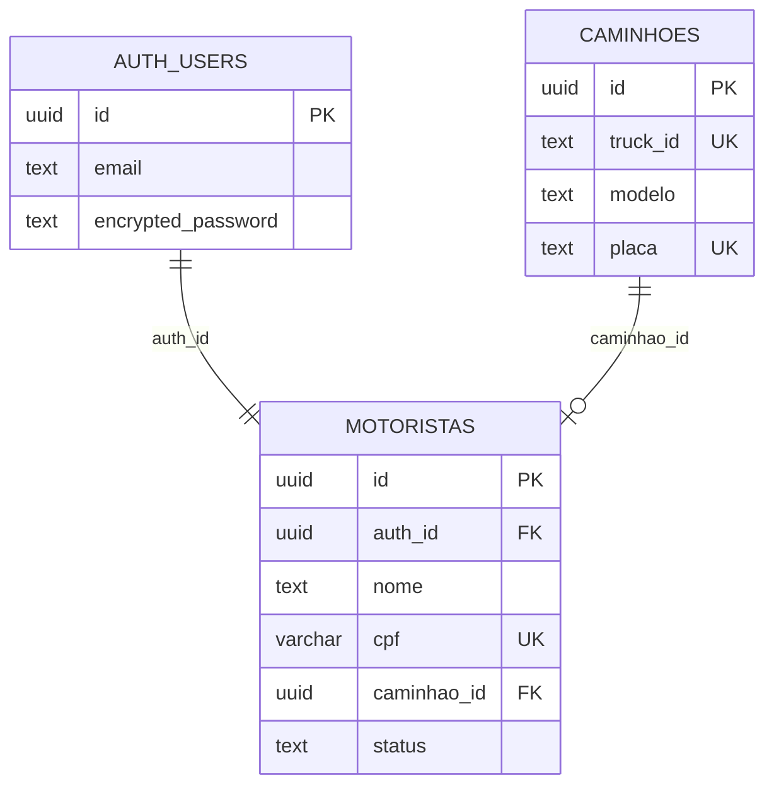
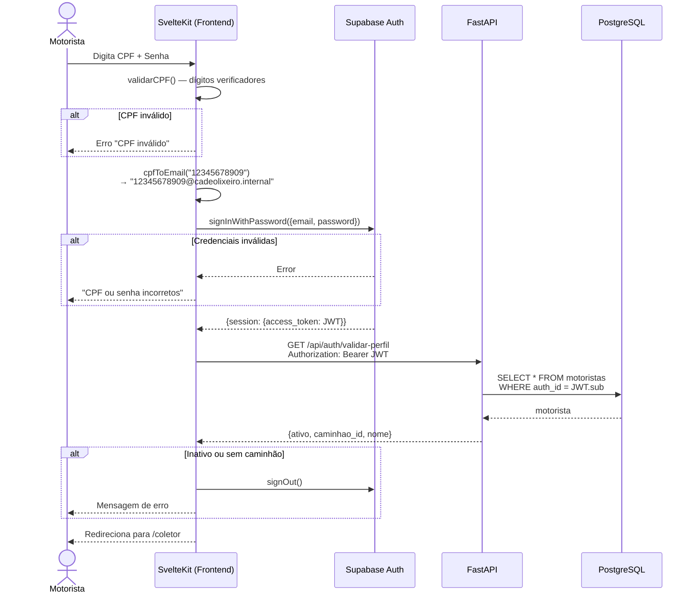

# 📐 SDD — AUT-1: Login do Motorista

> **Funcionalidade:** AUT-1 — Login do Motorista/Coletor
> **Documento:** Software Design Description
> **Norma de Referência:** IEEE 1016-2009
> **Versão:** 1.0
> **Data:** 24/05/2026
> **Requisito de Origem:** [AUT-1 — SRS](../srs/AUT-1-Login-Motorista.md)

---

## 1. Visão Geral e Stack

### 1.1 Contexto e Motivação

O motorista se autentica via CPF + Senha. O sistema formata silenciosamente o CPF como e-mail fictício (`{CPF}@cadeolixeiro.internal`) antes de enviar ao Supabase Auth, mantendo o fluxo padrão de autenticação sem expor a transformação ao usuário.

### 1.2 Stack Tecnológica

| Camada | Tecnologia | Justificativa |
|---|---|---|
| **Frontend** | SvelteKit (Svelte 5) + Tailwind CSS v4 | SPA com runes |
| **Autenticação** | Supabase Auth (`signInWithPassword`) | JWT gerenciado, bcrypt nativo |
| **Backend** | FastAPI (validação de perfil) | Verificação de status ativo + caminhão |
| **Banco** | Supabase PostgreSQL | Tabela `motoristas` com FK para `caminhoes` |

---

## 2. Visão de Decomposição

### 2.1 Arquivos Criados/Modificados

```
frontend/
└── src/
    ├── lib/
    │   ├── supabase.ts                    ← Client Supabase (singleton)
    │   ├── stores/
    │   │   └── auth.svelte.ts             ← Estado de autenticação (runes)
    │   └── utils/
    │       └── cpf.ts                     ← Validação + formatação de CPF
    └── routes/
        └── coletor/
            └── +layout.ts                 ← Guard de autenticação

backend/
└── app/
    ├── routers/
    │   └── auth.py                        ← Endpoint de validação de perfil
    └── models/
        └── motorista.py                   ← Model SQLAlchemy
```

### 2.2 Componentes e Responsabilidades

| Componente | Responsabilidade |
|---|---|
| `cpf.ts` | Validação de dígitos verificadores, remoção de máscara, formatação como e-mail |
| `auth.svelte.ts` | Rune store com estado do usuário autenticado (`$state`) |
| `supabase.ts` | Client Supabase inicializado com chaves do `.env` |
| `+layout.ts` (coletor) | Guard que verifica JWT válido e redireciona para `/` se não autenticado |
| `auth.py` | Endpoint `POST /api/auth/validar-perfil` que verifica status ativo e caminhão associado |

---

## 3. Modelagem de Dados

### 3.1 Tabela: `public.motoristas`

```sql
CREATE TABLE public.motoristas (
    id          UUID PRIMARY KEY DEFAULT gen_random_uuid(),
    auth_id     UUID NOT NULL REFERENCES auth.users(id) ON DELETE CASCADE,
    nome        TEXT NOT NULL,
    cpf         VARCHAR(11) NOT NULL UNIQUE,
    caminhao_id UUID REFERENCES public.caminhoes(id),
    status      TEXT NOT NULL DEFAULT 'ativo' CHECK (status IN ('ativo', 'inativo')),
    data_nascimento DATE,
    created_at  TIMESTAMPTZ DEFAULT now(),
    updated_at  TIMESTAMPTZ DEFAULT now()
);

CREATE UNIQUE INDEX idx_motoristas_cpf ON public.motoristas (cpf);
CREATE UNIQUE INDEX idx_motoristas_auth_id ON public.motoristas (auth_id);
```

### 3.2 Diagrama ER (Autenticação)



---

## 4. Visão de Interface (Contratos)

### 4.1 Fluxo de Autenticação (Frontend)

```typescript
// frontend/src/lib/utils/cpf.ts

/** Valida dígitos verificadores do CPF */
export function validarCPF(cpf: string): boolean {
    const limpo = cpf.replace(/\D/g, '')
    if (limpo.length !== 11 || /^(\d)\1+$/.test(limpo)) return false
    // Algoritmo de verificação dos 2 dígitos
    for (let t = 9; t < 11; t++) {
        let d = 0
        for (let c = 0; c < t; c++) d += parseInt(limpo[c]) * ((t + 1) - c)
        d = ((10 * d) % 11) % 10
        if (parseInt(limpo[t]) !== d) return false
    }
    return true
}

/** Formata CPF limpo como e-mail fictício */
export function cpfToEmail(cpf: string): string {
    return `${cpf.replace(/\D/g, '')}@cadeolixeiro.internal`
}

/** Aplica máscara visual: 12345678909 → 123.456.789-09 */
export function mascaraCPF(valor: string): string {
    return valor
        .replace(/\D/g, '')
        .replace(/(\d{3})(\d)/, '$1.$2')
        .replace(/(\d{3})(\d)/, '$1.$2')
        .replace(/(\d{3})(\d{1,2})$/, '$1-$2')
}
```

### 4.2 Fluxo de Login (Frontend → Supabase → FastAPI)

```typescript
// Dentro do componente de login (Svelte 5)
async function handleLogin() {
    const cpfLimpo = cpf.replace(/\D/g, '')
    if (!validarCPF(cpfLimpo)) {
        erro = 'CPF inválido.'
        return
    }

    // 1. Autenticação via Supabase Auth
    const { data, error } = await supabase.auth.signInWithPassword({
        email: cpfToEmail(cpfLimpo),
        password: senha,
    })

    if (error) {
        erro = 'CPF ou senha incorretos.'
        return
    }

    // 2. Validação de perfil via FastAPI
    const res = await fetch(`${API_URL}/api/auth/validar-perfil`, {
        headers: { 'Authorization': `Bearer ${data.session.access_token}` }
    })
    const perfil = await res.json()

    if (!perfil.ativo) {
        await supabase.auth.signOut()
        erro = 'Acesso não autorizado. Contate o administrador.'
        return
    }
    if (!perfil.caminhao_id) {
        await supabase.auth.signOut()
        erro = 'Nenhum veículo associado ao seu perfil.'
        return
    }

    // 3. Sucesso → redireciona
    goto('/coletor')
}
```

### 4.3 Endpoint FastAPI: Validação de Perfil

```python
# backend/app/routers/auth.py

from fastapi import APIRouter, Depends, HTTPException
from app.dependencies import get_current_user, get_db

router = APIRouter(prefix="/api/auth", tags=["auth"])

@router.get("/validar-perfil")
async def validar_perfil(
    user = Depends(get_current_user),
    db = Depends(get_db)
):
    """Verifica se o motorista está ativo e com caminhão associado."""
    motorista = await db.execute(
        select(Motorista).where(Motorista.auth_id == user.id)
    )
    motorista = motorista.scalar_one_or_none()

    if not motorista:
        raise HTTPException(404, "Perfil não encontrado")

    return {
        "ativo": motorista.status == "ativo",
        "caminhao_id": str(motorista.caminhao_id) if motorista.caminhao_id else None,
        "nome": motorista.nome,
    }
```

---

## 5. Visão de Dependências

| Dependência | Tipo | Uso |
|---|---|---|
| `@supabase/supabase-js` | Frontend | Client de autenticação |
| `supabase` (python) | Backend | Verificação de JWT |
| `python-jose[cryptography]` | Backend | Decodificação de JWT |
| `sqlalchemy[asyncio]` | Backend | Query de motorista |

---

## 6. Lógica de Processamento

### 6.1 Diagrama de Sequência — Login Completo



---

## 7. Mapeamento SRS → SDD

| Requisito SRS | Componente SDD | Status |
|---|---|---|
| **RF-AUT1-01** — Formulário CPF + Senha | Componente Svelte com inputs mascarados | ✅ |
| **RF-AUT1-02** — Formatação `{CPF}@cadeolixeiro.internal` | `cpfToEmail()` em `cpf.ts` | ✅ |
| **RF-AUT1-03** — `signInWithPassword` Supabase | Chamada no handler de login | ✅ |
| **RF-AUT1-04** — Verificar status ativo + caminhão | `GET /api/auth/validar-perfil` (FastAPI) | ✅ |
| **RF-AUT1-05** — Redirecionamento para `/coletor` | `goto('/coletor')` após validação | ✅ |
| **RF-AUT1-06** — Mensagens de erro genéricas | 3 cenários: CPF inválido, credencial, inativo | ✅ |
| **RF-AUT1-07** — Máscara de CPF | `mascaraCPF()` em `cpf.ts` | ✅ |
| **RF-AUT1-08** — Validação de dígitos | `validarCPF()` em `cpf.ts` | ✅ |

---

## 8. Riscos e Considerações

| Risco | Probabilidade | Impacto | Mitigação |
|---|:---:|:---:|---|
| E-mail fictício conflita com e-mail real | Nula | — | Domínio `@cadeolixeiro.internal` não existe na internet |
| Motorista tenta login com CPF não cadastrado | Média | Baixo | Supabase retorna erro genérico. Sem vazamento de informação |
| JWT expira durante coleta ativa | Média | Médio | Refresh token automático via Supabase. Token dura 8h |
| Rate limiting não implementado no Supabase Auth free | Baixa | Médio | Implementar rate limiting no FastAPI (`slowapi`) |

---

## 9. Decisões Arquiteturais Registradas

| # | Decisão | Alternativa Descartada | Justificativa |
|:-:|---------|----------------------|---------------|
| 1 | CPF como identificador de login | Matrícula, e-mail, username | CPF é universal, único, e todo motorista sabe de cor |
| 2 | E-mail fictício `@cadeolixeiro.internal` | Autenticação por telefone, custom auth | Mantém compatibilidade com Supabase Auth padrão sem customização |
| 3 | Validação de perfil via FastAPI (2ª chamada) | Tudo no Supabase (RLS + policies) | Lógica de "motorista ativo + caminhão" é complexa para RLS. FastAPI dá controle total |
| 4 | Guard no `+layout.ts` do `/coletor` | Middleware global | Proteção granular — apenas rotas sob `/coletor` exigem auth |
