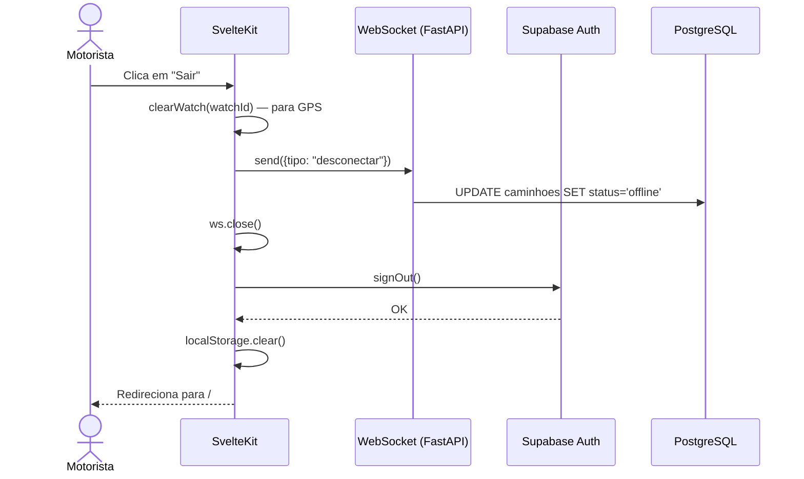

# 📐 SDD — AUT-2: Logout

> **Funcionalidade:** AUT-2 — Logout do Motorista
> **Documento:** Software Design Description
> **Norma de Referência:** IEEE 1016-2009
> **Versão:** 1.0
> **Data:** 24/05/2026
> **Requisito de Origem:** [AUT-2 — SRS](../srs/AUT-2-Logout.md)

---

## 1. Visão Geral e Stack

### 1.1 Contexto e Motivação

O logout deve encerrar graciosamente a sessão do motorista, interrompendo o compartilhamento de localização (GPS + WebSocket), revogando o JWT, e limpando dados locais. Isso garante que o dispositivo não permaneça autenticado após o uso.

### 1.2 Stack Tecnológica

| Camada | Tecnologia | Uso |
|---|---|---|
| **Frontend** | SvelteKit (Svelte 5) | Lógica de logout |
| **Auth** | Supabase Auth (`signOut`) | Revogação de JWT |
| **WebSocket** | FastAPI WS | Envio de mensagem de desconexão |
| **GPS** | Geolocation API | `clearWatch()` |

---

## 2. Visão de Decomposição

### 2.1 Arquivos Envolvidos

```
frontend/
└── src/
    └── lib/
        ├── stores/
        │   └── auth.svelte.ts         ← Função logout()
        └── stores/
            └── tracking.svelte.ts     ← Controle do WebSocket + GPS
```

### 2.2 Componentes e Responsabilidades

| Componente | Responsabilidade |
|---|---|
| `auth.svelte.ts` | `logout()` orquestra os 3 passos: parar tracking → signOut → limpar dados |
| `tracking.svelte.ts` | `pararRastreamento()` para GPS e fecha WebSocket com mensagem de desconexão |

---

## 3. Modelagem de Dados

Nenhuma alteração no schema. O logout atualiza o status do caminhão via mensagem WebSocket ao servidor.

---

## 4. Visão de Interface (Contratos)

### 4.1 Função de Logout (Frontend)

```typescript
// frontend/src/lib/stores/auth.svelte.ts

export async function logout() {
    // 1. Parar rastreamento (GPS + WebSocket)
    pararRastreamento()

    // 2. Revogar JWT no Supabase
    await supabase.auth.signOut()

    // 3. Limpar dados locais
    localStorage.removeItem('motorista')
    sessionStorage.clear()

    // 4. Redirecionar
    goto('/')
}
```

### 4.2 Parada de Rastreamento

```typescript
// frontend/src/lib/stores/tracking.svelte.ts

let watchId: number | null = $state(null)
let ws: WebSocket | null = $state(null)

export function pararRastreamento() {
    // Parar GPS
    if (watchId !== null) {
        navigator.geolocation.clearWatch(watchId)
        watchId = null
    }

    // Fechar WebSocket com mensagem de desconexão
    if (ws && ws.readyState === WebSocket.OPEN) {
        ws.send(JSON.stringify({ tipo: 'desconectar' }))
        ws.close(1000, 'Logout do motorista')
        ws = null
    }
}
```

### 4.3 Handler no Backend (WebSocket)

```python
# Dentro do WebSocket handler do FastAPI
async def handle_ws_message(data: dict, truck_id: str, db):
    if data.get("tipo") == "desconectar":
        # Marcar caminhão como offline
        await db.execute(
            update(Caminhao)
            .where(Caminhao.truck_id == truck_id)
            .values(status="offline", updated_at=func.now())
        )
        await db.commit()
```

---

## 5. Lógica de Processamento

### 5.1 Diagrama de Sequência — Logout



---

## 6. Mapeamento SRS → SDD

| Requisito SRS | Componente SDD | Status |
|---|---|---|
| **RF-AUT2-01** — Botão "Sair" no header | Componente de header com botão (visível apenas em `/coletor`) | ✅ |
| **RF-AUT2-02** — Parar GPS e WebSocket | `pararRastreamento()` em `tracking.svelte.ts` | ✅ |
| **RF-AUT2-03** — Revogar JWT | `supabase.auth.signOut()` | ✅ |
| **RF-AUT2-04** — Limpar dados locais | `localStorage/sessionStorage.clear()` | ✅ |
| **RF-AUT2-05** — Redirecionar para `/` | `goto('/')` | ✅ |
| **RF-AUT2-06** — Guard pós-logout | `+layout.ts` verifica sessão ativa | ✅ |

---

## 7. Riscos e Considerações

| Risco | Probabilidade | Impacto | Mitigação |
|---|:---:|:---:|---|
| WebSocket já fechado ao tentar enviar "desconectar" | Média | Baixo | Verificar `readyState === OPEN` antes de enviar |
| Rede indisponível no momento do logout | Baixa | Baixo | Limpeza local executa mesmo sem rede. Backend marca offline por timeout (5 min) |

---

## 8. Decisões Arquiteturais Registradas

| # | Decisão | Alternativa Descartada | Justificativa |
|:-:|---------|----------------------|---------------|
| 1 | Mensagem WS "desconectar" antes de fechar | Apenas fechar o WS e esperar timeout | Feedback instantâneo — cidadão vê caminhão offline imediatamente |
| 2 | `clearWatch` antes de `signOut` | Ordem inversa | Previne envio de coordenadas após revogação do JWT |
