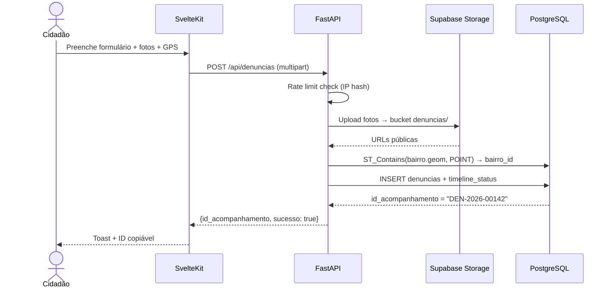

# 📐 SDD — DEN-1: Denúncias Anônimas

> **Funcionalidade:** DEN-1 — Sistema de Denúncias Ambientais Anônimas
> **Documento:** Software Design Description
> **Norma de Referência:** IEEE 1016-2009
> **Versão:** 1.0
> **Data:** 24/05/2026
> **Requisito de Origem:** [DEN-1 — SRS](../srs/DEN-1-Denuncias.md)

---

## 1. Visão Geral e Stack

### 1.1 Contexto e Motivação

Sistema de denúncias ambientais anônimas com upload de fotos (Supabase Storage), geolocalização (GPS + mapa), e acompanhamento por ID único. Denúncias resolvidas alimentam o ranking de bairros (GAM-1).

### 1.2 Arquitetura

```
┌─────────────────────┐     ┌──────────────────┐
│ SvelteKit (Frontend) │────►│ FastAPI (Backend) │
│  ├── Formulário      │     │  ├── POST /api/   │
│  ├── Mapa (GPS)      │     │  │   denuncias    │
│  └── Upload fotos    │     │  └── Geocodifica  │
└─────────┬───────────┘     └────────┬─────────┘
          │                          │
          ▼                          ▼
┌─────────────────┐        ┌─────────────────┐
│ Supabase Storage│        │ Supabase Postgres│
│  Bucket:        │        │  denuncias       │
│  denuncias/     │        │  timeline_status │
└─────────────────┘        └─────────────────┘
```

---

## 2. Visão de Decomposição

### 2.1 Arquivos

```
frontend/
└── src/
    ├── lib/components/
    │   ├── FormularioDenuncia.svelte    ← Form com tipo, descrição, fotos, mapa
    │   ├── MapaDenuncia.svelte          ← Mapa com marcador arrastável
    │   ├── UploadFotos.svelte           ← Upload 1-3 fotos com preview
    │   └── ConsultaStatus.svelte        ← Busca por ID de acompanhamento
    └── routes/denunciar/+page.svelte

backend/
└── app/
    ├── routers/denuncias.py             ← Endpoints CRUD
    └── models/denuncia.py               ← Model SQLAlchemy
```

---

## 3. Modelagem de Dados

### 3.1 Tabela: `public.denuncias`

```sql
CREATE TABLE public.denuncias (
    id                  UUID PRIMARY KEY DEFAULT gen_random_uuid(),
    id_acompanhamento   TEXT NOT NULL UNIQUE,  -- DEN-2026-00142
    tipo                TEXT NOT NULL CHECK (tipo IN (
        'area_contaminada', 'incendio_criminoso', 'descarte_ilegal'
    )),
    descricao           TEXT NOT NULL,
    latitude            DOUBLE PRECISION NOT NULL,
    longitude           DOUBLE PRECISION NOT NULL,
    bairro_id           UUID REFERENCES public.bairros(id),
    status              TEXT NOT NULL DEFAULT 'pendente' CHECK (status IN (
        'pendente', 'em_andamento', 'resolvida', 'descartada'
    )),
    fotos_urls          TEXT[] NOT NULL DEFAULT '{}',  -- URLs do Supabase Storage
    ip_hash             TEXT NOT NULL,                 -- SHA256 para rate limiting
    created_at          TIMESTAMPTZ DEFAULT now(),
    updated_at          TIMESTAMPTZ DEFAULT now()
);

CREATE INDEX idx_denuncias_status ON public.denuncias (status);
CREATE INDEX idx_denuncias_bairro ON public.denuncias (bairro_id);
CREATE INDEX idx_denuncias_acompanhamento ON public.denuncias (id_acompanhamento);

-- Sequência para IDs de acompanhamento
CREATE SEQUENCE seq_denuncia_id START 1;
```

### 3.2 Tabela: `public.timeline_status`

```sql
CREATE TABLE public.timeline_status (
    id              UUID PRIMARY KEY DEFAULT gen_random_uuid(),
    denuncia_id     UUID NOT NULL REFERENCES public.denuncias(id) ON DELETE CASCADE,
    status_anterior TEXT,
    status_novo     TEXT NOT NULL,
    observacao      TEXT,
    created_at      TIMESTAMPTZ DEFAULT now()
);

CREATE INDEX idx_timeline_denuncia ON public.timeline_status (denuncia_id, created_at);
```

---

## 4. Visão de Interface (Contratos)

### 4.1 Endpoints

| Método | Rota | Descrição |
|---|---|---|
| POST | `/api/denuncias` | Registrar denúncia (multipart/form-data) |
| GET | `/api/denuncias/{id_acompanhamento}` | Consultar status |

### 4.2 Criação de Denúncia (FastAPI)

```python
@router.post("/api/denuncias")
async def criar_denuncia(
    tipo: str = Form(...),
    descricao: str = Form(...),
    latitude: float = Form(...),
    longitude: float = Form(...),
    fotos: list[UploadFile] = File(...),
    request: Request = ...,
    db = Depends(get_db),
):
    # Rate limiting por IP
    ip_hash = hashlib.sha256(request.client.host.encode()).hexdigest()
    contagem = await db.execute(
        select(func.count()).where(
            Denuncia.ip_hash == ip_hash,
            Denuncia.created_at > datetime.utcnow() - timedelta(hours=24)
        )
    )
    if contagem.scalar() >= 5:
        raise HTTPException(429, "Limite de denúncias atingido.")

    # Validar fotos (1-3, max 5MB, JPG/PNG/WEBP)
    if len(fotos) < 1 or len(fotos) > 3:
        raise HTTPException(400, "Envie de 1 a 3 fotos.")
    for foto in fotos:
        if foto.size > 5 * 1024 * 1024:
            raise HTTPException(400, f"Foto {foto.filename} excede 5MB.")

    # Gerar ID de acompanhamento
    ano = datetime.utcnow().year
    seq = await db.execute(text("SELECT nextval('seq_denuncia_id')"))
    id_acomp = f"DEN-{ano}-{seq.scalar():05d}"

    # Upload fotos para Supabase Storage
    fotos_urls = []
    for foto in fotos:
        path = f"denuncias/{id_acomp}/{foto.filename}"
        conteudo = await foto.read()
        supabase.storage.from_("denuncias").upload(path, conteudo)
        url = supabase.storage.from_("denuncias").get_public_url(path)
        fotos_urls.append(url)

    # Detectar bairro via PostGIS
    bairro = await db.execute(
        select(Bairro.id).where(
            func.ST_Contains(Bairro.geom, func.ST_SetSRID(
                func.ST_MakePoint(longitude, latitude), 4326
            ))
        )
    )
    bairro_id = bairro.scalar_one_or_none()

    # Persistir denúncia
    denuncia = Denuncia(
        id_acompanhamento=id_acomp, tipo=tipo, descricao=descricao,
        latitude=latitude, longitude=longitude, bairro_id=bairro_id,
        fotos_urls=fotos_urls, ip_hash=ip_hash,
    )
    db.add(denuncia)

    # Timeline inicial
    timeline = TimelineStatus(
        denuncia_id=denuncia.id,
        status_novo="pendente",
    )
    db.add(timeline)
    await db.commit()

    return {"id_acompanhamento": id_acomp, "sucesso": True}
```

---

## 5. Lógica de Processamento

### 5.1 Diagrama de Sequência — Registrar Denúncia



---

## 6. Mapeamento SRS → SDD

| Requisito SRS | Componente SDD | Status |
|---|---|---|
| **RF-DEN1-01** — Formulário | `FormularioDenuncia.svelte` | ✅ |
| **RF-DEN1-03** — GPS automático | `MapaDenuncia.svelte` + geolocation | ✅ |
| **RF-DEN1-04** — Ajuste manual | Marcador arrastável (Leaflet `draggable: true`) | ✅ |
| **RF-DEN1-05** — Upload 1-3 fotos | `UploadFotos.svelte` + Supabase Storage | ✅ |
| **RF-DEN1-07** — ID acompanhamento | Sequência PostgreSQL `DEN-YYYY-NNNNN` | ✅ |
| **RF-DEN1-08** — Consulta status | `GET /api/denuncias/{id}` + timeline | ✅ |
| **RF-DEN1-10** — Impacto ranking | Trigger ou lógica no admin ao marcar `resolvida` | ✅ |
| **RF-DEN1-11** — Detecção de bairro | PostGIS `ST_Contains` | ✅ |
| **RF-DEN1-12** — Anonimato | IP hash (SHA256), sem dados pessoais | ✅ |

---

## 7. Decisões Arquiteturais

| # | Decisão | Justificativa |
|:-:|---------|---------------|
| 1 | `fotos_urls TEXT[]` em vez de tabela associativa | Max 3 fotos, sem necessidade de queries independentes |
| 2 | Sequência PostgreSQL para ID | Garante unicidade e ordem sem conflito em concorrência |
| 3 | `timeline_status` como tabela separada | Rastreabilidade — cada mudança de status é registrada com timestamp |
| 4 | Detecção de bairro via PostGIS | Mais preciso que Nominatim para bairros de Manaus (polígonos custom) |
