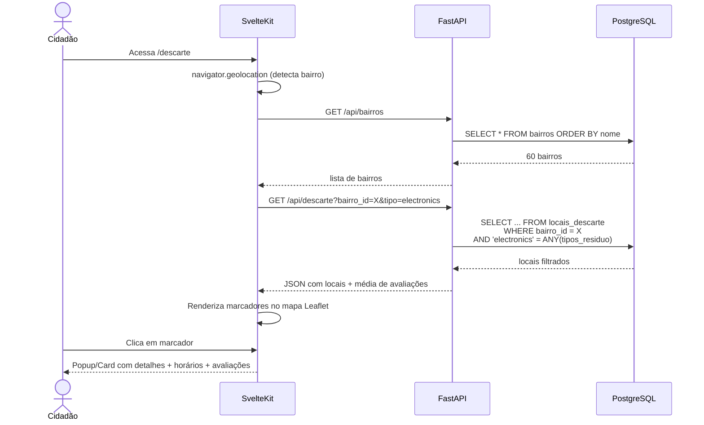

# 📐 SDD — DSC-1: Locais de Descarte

> **Funcionalidade:** DSC-1 — Consulta de Locais de Descarte Consciente
> **Documento:** Software Design Description
> **Norma de Referência:** IEEE 1016-2009
> **Versão:** 1.0
> **Data:** 24/05/2026
> **Requisito de Origem:** [DSC-1 — SRS](../srs/DSC-1-Locais-de-Descarte.md)

---

## 1. Visão Geral e Stack

### 1.1 Contexto e Motivação

Página pública para consulta de pontos de descarte consciente em Manaus, com filtros por bairro, tipo de resíduo e busca textual. Integra mapa Leaflet com detalhes de horário de funcionamento e avaliações anônimas.

### 1.2 Stack Tecnológica

| Camada | Tecnologia | Uso |
|---|---|---|
| **Frontend** | SvelteKit + Tailwind CSS v4 + Leaflet.js | SPA + mapa |
| **Backend** | FastAPI | API de locais + avaliações |
| **Banco** | Supabase PostgreSQL + PostGIS | Dados geoespaciais |

---

## 2. Visão de Decomposição

### 2.1 Arquivos

```
frontend/
└── src/
    ├── lib/
    │   └── components/
    │       ├── MapaDescarte.svelte       ← Mapa Leaflet com marcadores
    │       ├── FiltrosDescarte.svelte    ← Dropdown bairro + tipo + busca
    │       └── CardLocalDescarte.svelte  ← Card com detalhes + avaliações
    └── routes/
        └── descarte/
            └── +page.svelte             ← Página principal

backend/
└── app/
    ├── routers/
    │   └── descarte.py                  ← Endpoints de locais + avaliações
    └── models/
        └── local_descarte.py            ← Models SQLAlchemy
```

---

## 3. Modelagem de Dados

### 3.1 Tabela: `public.locais_descarte`

```sql
CREATE TABLE public.locais_descarte (
    id              UUID PRIMARY KEY DEFAULT gen_random_uuid(),
    nome            TEXT NOT NULL,
    endereco        TEXT NOT NULL,
    latitude        DOUBLE PRECISION NOT NULL,
    longitude       DOUBLE PRECISION NOT NULL,
    bairro_id       UUID NOT NULL REFERENCES public.bairros(id),
    tipos_residuo   TEXT[] NOT NULL,  -- Array: ['organic','electronics',...]
    horarios        JSONB,            -- {"seg":"08:00-17:00","ter":"08:00-17:00",...}
    telefone        TEXT,
    created_at      TIMESTAMPTZ DEFAULT now(),
    updated_at      TIMESTAMPTZ DEFAULT now()
);

CREATE INDEX idx_locais_bairro ON public.locais_descarte (bairro_id);
CREATE INDEX idx_locais_tipos ON public.locais_descarte USING GIN (tipos_residuo);
```

### 3.2 Tabela: `public.avaliacoes_descarte`

```sql
CREATE TABLE public.avaliacoes_descarte (
    id              UUID PRIMARY KEY DEFAULT gen_random_uuid(),
    local_id        UUID NOT NULL REFERENCES public.locais_descarte(id) ON DELETE CASCADE,
    estrelas        SMALLINT NOT NULL CHECK (estrelas BETWEEN 1 AND 5),
    comentario      TEXT,
    ip_hash         TEXT NOT NULL,  -- SHA256 do IP (para rate limiting, não identificável)
    created_at      TIMESTAMPTZ DEFAULT now()
);

CREATE INDEX idx_avaliacoes_local ON public.avaliacoes_descarte (local_id);
CREATE INDEX idx_avaliacoes_ip ON public.avaliacoes_descarte (ip_hash, created_at);
```

### 3.3 Tabela: `public.bairros`

```sql
CREATE TABLE public.bairros (
    id      UUID PRIMARY KEY DEFAULT gen_random_uuid(),
    nome    TEXT NOT NULL UNIQUE,
    geom    GEOMETRY(POLYGON, 4326)  -- PostGIS (opcional, para resolução espacial)
);

CREATE INDEX idx_bairros_geom ON public.bairros USING GIST (geom);
```

---

## 4. Visão de Interface (Contratos)

### 4.1 Endpoints FastAPI

| Método | Rota | Descrição | Params |
|---|---|---|---|
| GET | `/api/bairros` | Lista todos os bairros | — |
| GET | `/api/descarte` | Lista locais filtrados | `?bairro_id=&tipo=&busca=` |
| POST | `/api/descarte/{id}/avaliacao` | Enviar avaliação | Body: `{estrelas, comentario}` |
| GET | `/api/descarte/{id}/avaliacoes` | Listar avaliações | `?page=&limit=` |

### 4.2 Resposta: `GET /api/descarte`

```json
{
  "locais": [
    {
      "id": "uuid",
      "nome": "Ecoponto Centro",
      "endereco": "Rua Exemplo, 123",
      "latitude": -3.1190,
      "longitude": -60.0217,
      "bairro": "Centro",
      "tipos_residuo": ["recyclables", "electronics"],
      "horarios": {"seg": "08:00-17:00", "ter": "08:00-17:00"},
      "avaliacao_media": 4.2,
      "total_avaliacoes": 15
    }
  ]
}
```

### 4.3 Endpoint de Avaliação (FastAPI)

```python
@router.post("/api/descarte/{local_id}/avaliacao")
async def criar_avaliacao(
    local_id: UUID,
    avaliacao: AvaliacaoCreate,
    request: Request,
    db = Depends(get_db)
):
    ip_hash = hashlib.sha256(request.client.host.encode()).hexdigest()

    # Rate limiting: max 1 avaliação por local por IP por 24h
    existente = await db.execute(
        select(AvaliacaoDescarte)
        .where(
            AvaliacaoDescarte.local_id == local_id,
            AvaliacaoDescarte.ip_hash == ip_hash,
            AvaliacaoDescarte.created_at > datetime.utcnow() - timedelta(hours=24)
        )
    )
    if existente.scalar_one_or_none():
        raise HTTPException(429, "Você já avaliou este local hoje.")

    nova = AvaliacaoDescarte(
        local_id=local_id,
        estrelas=avaliacao.estrelas,
        comentario=avaliacao.comentario,
        ip_hash=ip_hash,
    )
    db.add(nova)
    await db.commit()
    return {"sucesso": True}
```

---

## 5. Lógica de Processamento

### 5.1 Diagrama de Sequência — Consulta com Filtros



---

## 6. Mapeamento SRS → SDD

| Requisito SRS | Componente SDD | Status |
|---|---|---|
| **RF-DSC1-01** — Mapa Leaflet | `MapaDescarte.svelte` | ✅ |
| **RF-DSC1-02** — Filtro por bairro | `FiltrosDescarte.svelte` + `GET /api/bairros` | ✅ |
| **RF-DSC1-03** — Filtro por tipo | Query `ANY(tipos_residuo)` | ✅ |
| **RF-DSC1-04** — Busca textual | Query `ILIKE %busca%` em nome/endereço | ✅ |
| **RF-DSC1-05** — GPS automático | `navigator.geolocation` + `ST_Contains(geom, POINT)` | ✅ |
| **RF-DSC1-06** — Popup com detalhes | `CardLocalDescarte.svelte` | ✅ |
| **RF-DSC1-07** — Avaliações anônimas | `POST /api/descarte/{id}/avaliacao` + rate limit por IP | ✅ |
| **RF-DSC1-08** — fitBounds | Leaflet `map.fitBounds()` | ✅ |
| **RF-DSC1-09** — Mensagem vazia | Componente condicional no Svelte | ✅ |

---

## 7. Riscos e Considerações

| Risco | Probabilidade | Impacto | Mitigação |
|---|:---:|:---:|---|
| Spam de avaliações via VPN | Baixa | Baixo | Rate limit por IP hash. Moderação manual se necessário |
| Bairros sem geometria PostGIS | Média | Médio | Fallback para Nominatim na detecção GPS |
| `horarios` JSONB com formato inconsistente | Baixa | Baixo | Validação Pydantic no endpoint de CRUD admin |

---

## 8. Decisões Arquiteturais Registradas

| # | Decisão | Alternativa Descartada | Justificativa |
|:-:|---------|----------------------|---------------|
| 1 | `tipos_residuo` como array TEXT[] | Tabela associativa N:N | Simplicidade — tipos são enum fixo, sem FK necessária |
| 2 | `horarios` como JSONB | Tabela `horarios_funcionamento` | Flexibilidade — cada local pode ter horários diferentes por dia |
| 3 | IP hash (SHA256) para rate limit | Armazenar IP real | Privacidade — hash irreversível, sem dados pessoais |
| 4 | Avaliação sem login | Exigir cadastro | Mantém coerência com decisão de "tudo público, sem contas para cidadão" |
