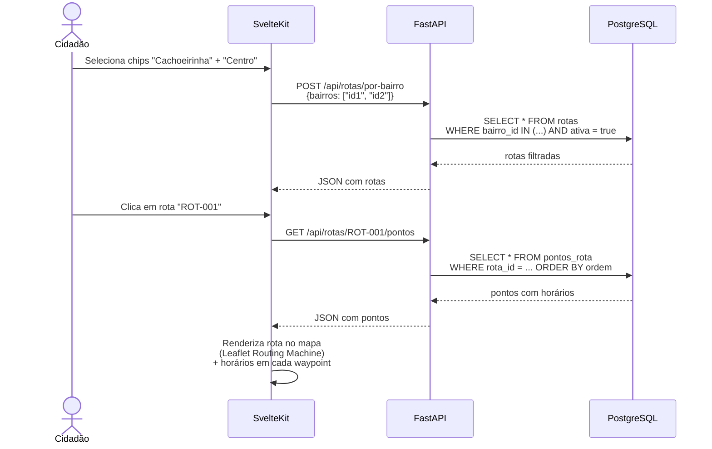

# 📐 SDD — HOR-1: Horários de Passagem

> **Funcionalidade:** HOR-1 — Consulta de Horários de Passagem
> **Documento:** Software Design Description
> **Norma de Referência:** IEEE 1016-2009
> **Versão:** 1.0
> **Data:** 24/05/2026
> **Requisito de Origem:** [HOR-1 — SRS](../srs/HOR-1-Horarios-de-Passagem.md)

---

## 1. Visão Geral e Stack

### 1.1 Contexto e Motivação

A versão legada exibe rotas mas não mostra horários reais nem dias da semana. O novo design ativa o campo `passage_time` existente, adiciona dias da semana e tipo de coleta, e renderiza a rota no mapa com horários em cada ponto.

---

## 2. Visão de Decomposição

### 2.1 Arquivos

```
frontend/
└── src/
    ├── lib/components/
    │   ├── ChipsBairros.svelte          ← Seleção múltipla de bairros
    │   ├── TabelaRotas.svelte           ← Tabela com rotas filtradas
    │   └── MapaRota.svelte              ← Rota no mapa (Leaflet Routing Machine)
    └── routes/horarios/+page.svelte

backend/
└── app/routers/rotas.py                ← Endpoints de rotas por bairro
```

---

## 3. Modelagem de Dados

### 3.1 Campos adicionados em `public.rotas`

```sql
CREATE TABLE public.rotas (
    id              UUID PRIMARY KEY DEFAULT gen_random_uuid(),
    caminhao_id     UUID NOT NULL REFERENCES public.caminhoes(id),
    rota_id         TEXT NOT NULL UNIQUE,
    bairro_id       UUID NOT NULL REFERENCES public.bairros(id),
    tipo_coleta     TEXT NOT NULL DEFAULT 'geral'
                    CHECK (tipo_coleta IN ('organico','reciclavel','perigoso','verde','geral')),
    dias_semana     TEXT[] NOT NULL DEFAULT '{}',  -- ['seg','qua','sex']
    endereco_inicio TEXT,
    endereco_fim    TEXT,
    ativa           BOOLEAN NOT NULL DEFAULT true,
    created_at      TIMESTAMPTZ DEFAULT now(),
    updated_at      TIMESTAMPTZ DEFAULT now()
);
```

### 3.2 Tabela: `public.pontos_rota`

```sql
CREATE TABLE public.pontos_rota (
    id              UUID PRIMARY KEY DEFAULT gen_random_uuid(),
    rota_id         UUID NOT NULL REFERENCES public.rotas(id) ON DELETE CASCADE,
    endereco        TEXT NOT NULL,
    latitude        DOUBLE PRECISION NOT NULL,
    longitude       DOUBLE PRECISION NOT NULL,
    cep             TEXT,
    ordem           SMALLINT NOT NULL,
    horario_passagem TIME NOT NULL,
    created_at      TIMESTAMPTZ DEFAULT now()
);

CREATE INDEX idx_pontos_rota ON public.pontos_rota (rota_id, ordem);
```

---

## 4. Visão de Interface (Contratos)

### 4.1 Endpoints

| Método | Rota | Descrição |
|---|---|---|
| POST | `/api/rotas/por-bairro` | Busca rotas por lista de bairro_ids |
| GET | `/api/rotas/{rota_id}/pontos` | Retorna pontos da rota com horários |

### 4.2 Resposta: `POST /api/rotas/por-bairro`

```json
{
  "rotas": [
    {
      "id": "uuid",
      "rota_id": "ROT-001",
      "caminhao_id": "CAM-001",
      "bairro": "Cachoeirinha",
      "tipo_coleta": "reciclavel",
      "dias_semana": ["seg", "qua", "sex"],
      "endereco_inicio": "Rua A, 100",
      "endereco_fim": "Rua Z, 500",
      "total_pontos": 12
    }
  ]
}
```

---

## 5. Lógica de Processamento

### 5.1 Diagrama de Sequência



---

## 6. Mapeamento SRS → SDD

| Requisito SRS | Componente SDD | Status |
|---|---|---|
| **RF-HOR1-01** — Chips de bairros | `ChipsBairros.svelte` + `GET /api/bairros` | ✅ |
| **RF-HOR1-02** — Tabela com rotas | `TabelaRotas.svelte` | ✅ |
| **RF-HOR1-03** — Horário real | Campo `horario_passagem` em `pontos_rota` | ✅ |
| **RF-HOR1-04** — Dias da semana | Campo `dias_semana TEXT[]` em `rotas` | ✅ |
| **RF-HOR1-05** — Tipo de coleta | Campo `tipo_coleta` em `rotas` | ✅ |
| **RF-HOR1-06** — Rota no mapa | `MapaRota.svelte` + Leaflet Routing Machine | ✅ |
| **RF-HOR1-07** — Notificação push | Delegado para SDD NOT-1 | ✅ |

---

## 7. Decisões Arquiteturais

| # | Decisão | Justificativa |
|:-:|---------|---------------|
| 1 | `dias_semana` como array TEXT[] | Flexibilidade — não precisa de tabela auxiliar para 7 valores fixos |
| 2 | `tipo_coleta` como enum CHECK | Evita tabela de lookup para 5 valores fixos |
