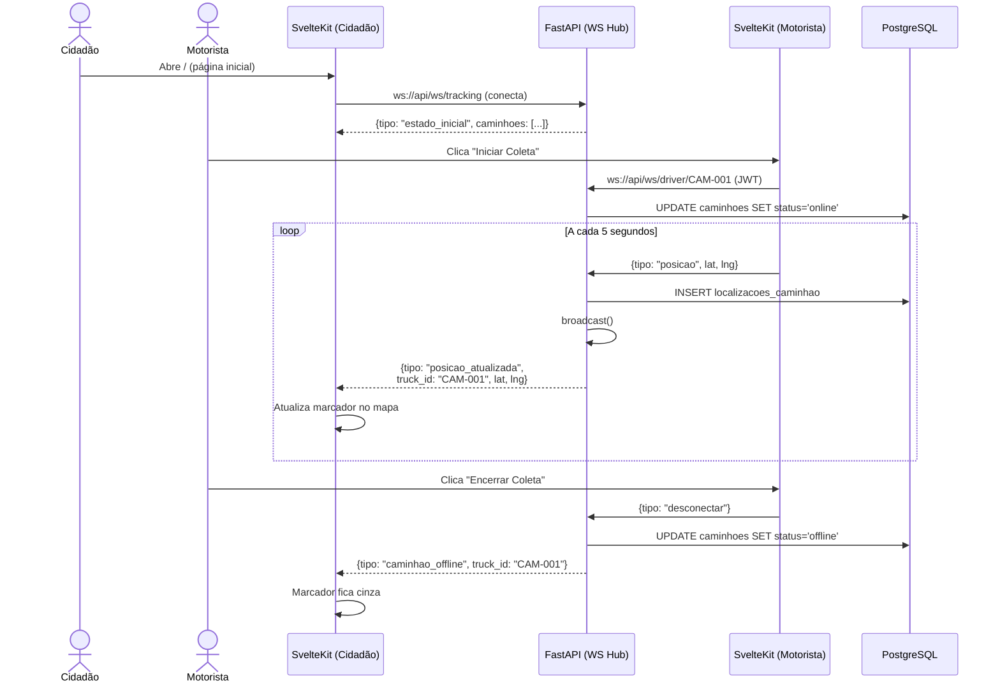

# 📐 SDD — RAT-1: Rastreamento de Caminhões (Cidadão)

> **Funcionalidade:** RAT-1 — Rastreamento em Tempo Real (Visão do Cidadão)
> **Documento:** Software Design Description
> **Norma de Referência:** IEEE 1016-2009
> **Versão:** 1.0
> **Data:** 24/05/2026
> **Requisito de Origem:** [RAT-1 — SRS](../srs/RAT-1-Rastreamento-Cidadao.md)

---

## 1. Visão Geral e Stack

### 1.1 Contexto e Motivação

A versão legada usa HTTP POST síncrono + `time.sleep(1)` para rastreamento — inviável com mais de 5 caminhões. A nova versão usa **WebSocket** para atualizações instantâneas e bidirecionais, suportando 100+ caminhões simultâneos.

### 1.2 Arquitetura TO-BE

```
┌──────────────────────────────────┐
│   SvelteKit (Cidadão)            │
│   ws://api/ws/tracking           │
│   ├── Recebe posições broadcast  │
│   ├── Filtra por bairro (local)  │
│   └── Atualiza marcadores Leaflet│
└───────────────┬──────────────────┘
                │ WebSocket
┌───────────────▼──────────────────┐
│   FastAPI (WebSocket Hub)        │
│   ├── /ws/tracking (cidadãos)    │
│   ├── /ws/driver/{truck_id}      │
│   │   (motoristas autenticados)  │
│   └── Broadcast Manager          │
│       ├── Recebe do motorista    │
│       ├── Persiste no DB         │
│       └── Broadcast p/ cidadãos  │
└───────────────┬──────────────────┘
                │ SQL
┌───────────────▼──────────────────┐
│   Supabase PostgreSQL            │
│   ├── localizacoes_caminhao      │
│   └── caminhoes (status)         │
└──────────────────────────────────┘
```

### 1.3 Stack Tecnológica

| Camada | Tecnologia | Uso |
|---|---|---|
| **Frontend** | SvelteKit + Leaflet.js | Mapa + WebSocket client |
| **Backend** | FastAPI + WebSocket nativo | Hub de broadcast |
| **Banco** | Supabase PostgreSQL | Persistência de posições |

---

## 2. Visão de Decomposição

### 2.1 Arquivos

```
frontend/
└── src/
    ├── lib/
    │   ├── components/
    │   │   ├── MapaRastreamento.svelte    ← Mapa com marcadores animados
    │   │   ├── LegendaCaminhoes.svelte    ← Lista lateral de caminhões
    │   │   └── IndicadorConexao.svelte    ← Badge online/offline
    │   └── stores/
    │       └── tracking.svelte.ts         ← WebSocket client + estado
    └── routes/
        └── +page.svelte                   ← Página inicial

backend/
└── app/
    ├── websockets/
    │   ├── manager.py                     ← ConnectionManager (broadcast)
    │   ├── tracking_hub.py                ← Handler WS cidadão
    │   └── driver_hub.py                  ← Handler WS motorista
    └── models/
        └── localizacao.py                 ← Model SQLAlchemy
```

### 2.2 Componentes e Responsabilidades

| Componente | Responsabilidade |
|---|---|
| `ConnectionManager` | Gerencia conexões WS de cidadãos. Broadcast de posições para todos conectados |
| `tracking_hub.py` | Endpoint `ws://api/ws/tracking` — conexões públicas (sem auth) |
| `driver_hub.py` | Endpoint `ws://api/ws/driver/{truck_id}` — conexões autenticadas (JWT) |
| `tracking.svelte.ts` | Client WS com reconexão automática, estado reativo (runes) |
| `MapaRastreamento.svelte` | Leaflet com marcadores animados (transição de posição) |

---

## 3. Modelagem de Dados

### 3.1 Tabela: `public.localizacoes_caminhao`

```sql
CREATE TABLE public.localizacoes_caminhao (
    id          BIGINT GENERATED ALWAYS AS IDENTITY PRIMARY KEY,
    caminhao_id UUID NOT NULL REFERENCES public.caminhoes(id),
    latitude    DOUBLE PRECISION NOT NULL,
    longitude   DOUBLE PRECISION NOT NULL,
    endereco    TEXT,                          -- Geocodificado assincronamente
    cep         TEXT,
    created_at  TIMESTAMPTZ DEFAULT now()
);

CREATE INDEX idx_loc_caminhao ON public.localizacoes_caminhao (caminhao_id, created_at DESC);
```

### 3.2 Campo `status` na tabela `caminhoes`

```sql
ALTER TABLE public.caminhoes
    ADD COLUMN status TEXT NOT NULL DEFAULT 'offline'
        CHECK (status IN ('online', 'offline')),
    ADD COLUMN ultima_posicao_lat DOUBLE PRECISION,
    ADD COLUMN ultima_posicao_lng DOUBLE PRECISION,
    ADD COLUMN ultimo_endereco TEXT,
    ADD COLUMN updated_at TIMESTAMPTZ DEFAULT now();
```

---

## 4. Visão de Interface (Contratos)

### 4.1 WebSocket Manager (Backend)

```python
# backend/app/websockets/manager.py

from fastapi import WebSocket
from typing import Dict, Set
import json

class ConnectionManager:
    """Gerencia conexões WebSocket de cidadãos e broadcast de posições."""

    def __init__(self):
        self.cidadaos: Set[WebSocket] = set()
        self.motoristas: Dict[str, WebSocket] = {}  # truck_id → ws

    async def conectar_cidadao(self, ws: WebSocket):
        await ws.accept()
        self.cidadaos.add(ws)
        # Envia estado atual de todos os caminhões online
        await ws.send_json({
            "tipo": "estado_inicial",
            "caminhoes": self._get_estado_atual()
        })

    def desconectar_cidadao(self, ws: WebSocket):
        self.cidadaos.discard(ws)

    async def conectar_motorista(self, ws: WebSocket, truck_id: str):
        await ws.accept()
        self.motoristas[truck_id] = ws

    async def desconectar_motorista(self, truck_id: str):
        self.motoristas.pop(truck_id, None)
        await self.broadcast({
            "tipo": "caminhao_offline",
            "truck_id": truck_id,
        })

    async def broadcast(self, mensagem: dict):
        """Envia mensagem para TODOS os cidadãos conectados."""
        mortos = set()
        for ws in self.cidadaos:
            try:
                await ws.send_json(mensagem)
            except Exception:
                mortos.add(ws)
        self.cidadaos -= mortos

    async def receber_posicao(self, truck_id: str, lat: float, lng: float):
        """Recebe posição do motorista e broadcast para cidadãos."""
        await self.broadcast({
            "tipo": "posicao_atualizada",
            "truck_id": truck_id,
            "latitude": lat,
            "longitude": lng,
            "timestamp": datetime.utcnow().isoformat(),
        })

manager = ConnectionManager()
```

### 4.2 Mensagens WebSocket (Protocolo)

| Direção | Tipo | Payload | Descrição |
|---|---|---|---|
| Server → Cidadão | `estado_inicial` | `{caminhoes: [{truck_id, lat, lng, status}]}` | Estado de todos os caminhões ao conectar |
| Server → Cidadão | `posicao_atualizada` | `{truck_id, lat, lng, timestamp}` | Nova posição de um caminhão |
| Server → Cidadão | `caminhao_offline` | `{truck_id}` | Caminhão saiu do ar |
| Motorista → Server | `posicao` | `{lat, lng, timestamp}` | Envio de coordenada |
| Motorista → Server | `desconectar` | `{}` | Logout gracioso |

### 4.3 Client WebSocket (Frontend — Svelte 5 Runes)

```typescript
// frontend/src/lib/stores/tracking.svelte.ts

let caminhoes = $state<Map<string, CaminhaoPos>>(new Map())
let conectado = $state(false)
let ws: WebSocket | null = null
let tentativas = 0
const MAX_TENTATIVAS = 10

export function conectarTracking() {
    ws = new WebSocket(`${WS_URL}/ws/tracking`)

    ws.onopen = () => {
        conectado = true
        tentativas = 0
    }

    ws.onmessage = (event) => {
        const msg = JSON.parse(event.data)

        if (msg.tipo === 'estado_inicial') {
            caminhoes = new Map(
                msg.caminhoes.map((c: any) => [c.truck_id, c])
            )
        }

        if (msg.tipo === 'posicao_atualizada') {
            caminhoes.set(msg.truck_id, {
                truck_id: msg.truck_id,
                latitude: msg.latitude,
                longitude: msg.longitude,
                timestamp: msg.timestamp,
                status: 'online'
            })
            // Trigger reatividade
            caminhoes = new Map(caminhoes)
        }

        if (msg.tipo === 'caminhao_offline') {
            const c = caminhoes.get(msg.truck_id)
            if (c) {
                c.status = 'offline'
                caminhoes = new Map(caminhoes)
            }
        }
    }

    ws.onclose = () => {
        conectado = false
        if (tentativas < MAX_TENTATIVAS) {
            tentativas++
            setTimeout(conectarTracking, 5000)
        }
    }
}

// Filtro local por bairro (sem nova requisição)
export function filtrarPorBairro(bairro: string | null) {
    // Aplicado no componente do mapa ao iterar sobre caminhoes
}
```

---

## 5. Visão de Dependências

| Dependência | Tipo | Uso |
|---|---|---|
| `leaflet` | Frontend | Mapa interativo |
| `websocket` (nativo FastAPI) | Backend | Conexões persistentes |
| `asyncio` | Backend | Async broadcast |
| `httpx` | Backend | Geocodificação Nominatim (background) |

---

## 6. Lógica de Processamento

### 6.1 Diagrama de Sequência — Rastreamento Completo



---

## 7. Mapeamento SRS → SDD

| Requisito SRS | Componente SDD | Status |
|---|---|---|
| **RF-RAT1-01** — Mapa Leaflet | `MapaRastreamento.svelte` | ✅ |
| **RF-RAT1-02** — WebSocket | `tracking.svelte.ts` + `manager.py` | ✅ |
| **RF-RAT1-03** — Marcadores animados | Transição CSS + Leaflet `setLatLng` | ✅ |
| **RF-RAT1-04** — Popup com detalhes | `bindPopup()` no marcador | ✅ |
| **RF-RAT1-05** — Filtro por bairro | Filtro local no frontend | ✅ |
| **RF-RAT1-06** — Legenda lateral | `LegendaCaminhoes.svelte` | ✅ |
| **RF-RAT1-07** — GPS do cidadão | `navigator.geolocation` | ✅ |
| **RF-RAT1-08** — Mensagem vazia | Condicional no Svelte | ✅ |
| **RF-RAT1-09** — Indicador conexão | `IndicadorConexao.svelte` | ✅ |

---

## 8. Riscos e Considerações

| Risco | Probabilidade | Impacto | Mitigação |
|---|:---:|:---:|---|
| Muitos cidadãos conectados (broadcast lento) | Média | Médio | Throttle de 1s no broadcast. Usar Redis pub/sub se escalar. |
| WebSocket cai em redes instáveis (3G/4G) | Alta | Baixo | Reconexão automática (5s, max 10 tentativas) |
| Volume de `localizacoes_caminhao` cresce rápido | Média | Médio | Retention policy: dados > 30 dias compactados para agregação por minuto |

---

## 9. Decisões Arquiteturais Registradas

| # | Decisão | Alternativa Descartada | Justificativa |
|:-:|---------|----------------------|---------------|
| 1 | WebSocket nativo do FastAPI | Supabase Realtime | Controle total sobre o protocolo e broadcast. Supabase Realtime teria limitações de customização |
| 2 | Filtro de bairro no frontend | Filtro no servidor (rooms de WS) | Simplicidade — volume de caminhões é baixo (<100). Filtro local é instantâneo |
| 3 | `ConnectionManager` em memória | Redis pub/sub | MVP. Migrar para Redis quando escalar para múltiplas instâncias FastAPI |
| 4 | Persistência a cada posição | Persistência a cada N posições | Histórico completo para analytics. Compactação posterior |
