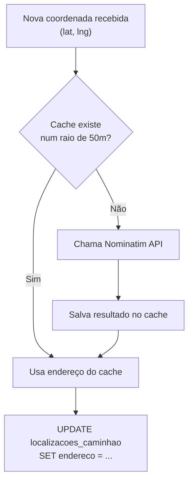

# 📐 SDD — RAT-2: Compartilhamento de Localização (Motorista)

> **Funcionalidade:** RAT-2 — Compartilhamento de Localização em Tempo Real
> **Documento:** Software Design Description
> **Norma de Referência:** IEEE 1016-2009
> **Versão:** 1.0
> **Data:** 24/05/2026
> **Requisito de Origem:** [RAT-2 — SRS](../srs/RAT-2-Compartilhamento-Localizacao.md)

---

## 1. Visão Geral e Stack

### 1.1 Contexto e Motivação

O motorista autenticado transmite sua localização GPS via WebSocket autenticado (JWT). O servidor FastAPI persiste cada posição, geocodifica assincronamente (Nominatim com cache) e retransmite via broadcast para os cidadãos conectados.

### 1.2 Stack Tecnológica

| Camada | Tecnologia | Uso |
|---|---|---|
| **Frontend** | SvelteKit + Svelte 5 runes | GPS watchPosition + WebSocket client |
| **Backend** | FastAPI WebSocket + BackgroundTasks | Hub autenticado + geocodificação async |
| **Geocodificação** | Nominatim + cache PostgreSQL | Conversão coordenadas → endereço |

---

## 2. Visão de Decomposição

### 2.1 Arquivos

```
frontend/
└── src/
    └── lib/
        └── stores/
            └── tracking.svelte.ts      ← Funções iniciarColeta/pararColeta

backend/
└── app/
    ├── websockets/
    │   └── driver_hub.py               ← Handler WS do motorista
    └── services/
        └── geocodificacao.py           ← Cache Nominatim + PostGIS
```

### 2.2 Componentes e Responsabilidades

| Componente | Responsabilidade |
|---|---|
| `tracking.svelte.ts` | `iniciarColeta()`: ativa GPS + abre WS. `pararColeta()`: para GPS + fecha WS |
| `driver_hub.py` | Valida JWT, recebe posições, persiste, dispara geocodificação async, broadcast |
| `geocodificacao.py` | Verifica cache (raio 50m) → Nominatim → salva cache. Nunca bloqueia |

---

## 3. Modelagem de Dados

### 3.1 Tabela: `public.cache_geocodificacao`

```sql
CREATE TABLE public.cache_geocodificacao (
    id          BIGINT GENERATED ALWAYS AS IDENTITY PRIMARY KEY,
    latitude    DOUBLE PRECISION NOT NULL,
    longitude   DOUBLE PRECISION NOT NULL,
    geom        GEOMETRY(POINT, 4326) NOT NULL,
    endereco    TEXT NOT NULL,
    bairro_id   UUID REFERENCES public.bairros(id),
    cep         TEXT,
    created_at  TIMESTAMPTZ DEFAULT now()
);

CREATE INDEX idx_cache_geom ON public.cache_geocodificacao USING GIST (geom);
```

---

## 4. Visão de Interface (Contratos)

### 4.1 WebSocket Handler do Motorista (FastAPI)

```python
# backend/app/websockets/driver_hub.py

@app.websocket("/ws/driver/{truck_id}")
async def ws_motorista(websocket: WebSocket, truck_id: str, db = Depends(get_db)):
    # Validar JWT do header/query
    token = websocket.query_params.get("token")
    user = await verificar_jwt(token)
    if not user:
        await websocket.close(code=4001, reason="Não autorizado")
        return

    await manager.conectar_motorista(websocket, truck_id)
    await db.execute(
        update(Caminhao).where(Caminhao.truck_id == truck_id)
        .values(status="online")
    )
    await db.commit()

    try:
        while True:
            data = await websocket.receive_json()

            if data.get("tipo") == "desconectar":
                break

            if data.get("tipo") == "posicao":
                lat, lng = data["lat"], data["lng"]

                # Persistir posição
                loc = LocalizacaoCaminhao(
                    caminhao_id=truck_id, latitude=lat, longitude=lng
                )
                db.add(loc)
                await db.commit()

                # Atualizar posição atual do caminhão
                await db.execute(
                    update(Caminhao).where(Caminhao.truck_id == truck_id)
                    .values(
                        ultima_posicao_lat=lat,
                        ultima_posicao_lng=lng,
                        updated_at=func.now()
                    )
                )
                await db.commit()

                # Geocodificação assíncrona (não bloqueia)
                asyncio.create_task(
                    geocodificar_e_atualizar(db, loc.id, lat, lng)
                )

                # Broadcast para cidadãos
                await manager.receber_posicao(truck_id, lat, lng)
    except WebSocketDisconnect:
        pass
    finally:
        await manager.desconectar_motorista(truck_id)
        await db.execute(
            update(Caminhao).where(Caminhao.truck_id == truck_id)
            .values(status="offline")
        )
        await db.commit()
```

### 4.2 Geocodificação com Cache (50m)

```python
# backend/app/services/geocodificacao.py

async def geocodificar_e_atualizar(db, loc_id: int, lat: float, lng: float):
    """Geocodifica coordenadas com cache espacial de 50m."""
    # 1. Verificar cache (raio de 50m)
    ponto = f"SRID=4326;POINT({lng} {lat})"
    cache = await db.execute(
        select(CacheGeocodificacao)
        .where(func.ST_DWithin(
            CacheGeocodificacao.geom,
            func.ST_GeomFromText(ponto, 4326),
            0.0005  # ~50m em graus
        ))
        .limit(1)
    )
    cache = cache.scalar_one_or_none()

    if cache:
        endereco = cache.endereco
    else:
        # 2. Chamar Nominatim
        async with httpx.AsyncClient() as client:
            resp = await client.get(
                f"https://nominatim.openstreetmap.org/reverse",
                params={"format": "jsonv2", "lat": lat, "lon": lng},
                headers={"User-Agent": "CadeOLixeiro/2.0"}
            )
            data = resp.json()
            endereco = data.get("display_name", "")

            # 3. Salvar no cache
            novo_cache = CacheGeocodificacao(
                latitude=lat, longitude=lng,
                geom=ponto, endereco=endereco,
            )
            db.add(novo_cache)

    # 4. Atualizar localização com endereço
    await db.execute(
        update(LocalizacaoCaminhao)
        .where(LocalizacaoCaminhao.id == loc_id)
        .values(endereco=endereco)
    )
    await db.commit()
```

---

## 5. Lógica de Processamento

### 5.1 Fluxo de Geocodificação com Cache



---

## 6. Mapeamento SRS → SDD

| Requisito SRS | Componente SDD | Status |
|---|---|---|
| **RF-RAT2-01** — Botão "Iniciar Coleta" | `tracking.svelte.ts` → `iniciarColeta()` | ✅ |
| **RF-RAT2-02** — watchPosition | `enableHighAccuracy: true`, callback a cada 5s | ✅ |
| **RF-RAT2-03** — WebSocket autenticado | JWT via query param na conexão WS | ✅ |
| **RF-RAT2-04** — Envio a cada 5s | Throttle no frontend (intervalo mínimo 5s) | ✅ |
| **RF-RAT2-05** — Persistência | INSERT em `localizacoes_caminhao` | ✅ |
| **RF-RAT2-06** — Geocodificação async | `asyncio.create_task()` + cache 50m | ✅ |
| **RF-RAT2-09** — Botão "Encerrar Coleta" | `pararColeta()` → `clearWatch` + WS close | ✅ |
| **RF-RAT2-10** — Reconexão automática | Retry com backoff (5s, max 10) | ✅ |

---

## 7. Decisões Arquiteturais Registradas

| # | Decisão | Alternativa Descartada | Justificativa |
|:-:|---------|----------------------|---------------|
| 1 | Cache espacial de 50m (PostGIS `ST_DWithin`) | Cache por hash de coordenada | Coordenadas nunca são exatamente iguais. Raio espacial é a abordagem correta |
| 2 | JWT via query param no WS | JWT via header WS | WebSocket API do browser não suporta headers customizados. Query param é o padrão |
| 3 | `asyncio.create_task` para geocodificação | Background worker (Celery) | Simplicidade — volume de geocodificação é baixo com cache agressivo |
| 4 | Anti-spam de 3s no servidor | Apenas throttle no frontend | Defense in depth — frontend pode ser manipulado |
