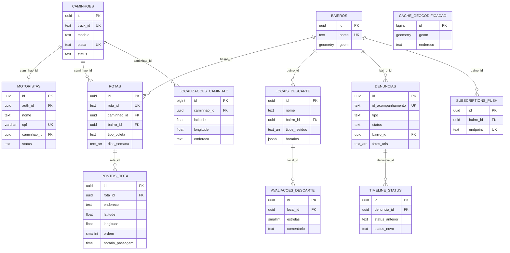

# 📐 Cadê o Lixeiro? v2.0 — Índice de Design Técnico (SDD)

> **Projeto:** Cadê o Lixeiro? — Gestão Inteligente de Resíduos Urbanos
> **Padrão:** IEEE 1016-2009
> **Stack:** SvelteKit 5 (SPA) + Tailwind CSS v4 + FastAPI (Python 3.12) + Supabase (PostgreSQL/PostGIS)
> **Hosting:** Appwrite (frontend SPA) + Railway (FastAPI backend) + Supabase (banco/auth/storage)

---

## Decisões Transversais

| Decisão | Escolha |
|---------|---------|
| **Framework Frontend** | SvelteKit com adapter-static (SPA), Svelte 5 (runes) |
| **CSS** | Tailwind CSS v4 |
| **Backend** | FastAPI (Python 3.12) |
| **ORM** | SQLAlchemy 2.0 + GeoAlchemy2 |
| **Banco de Dados** | Supabase PostgreSQL + PostGIS |
| **Autenticação** | Supabase Auth (JWT) |
| **Storage** | Supabase Storage |
| **Migrações** | Supabase Migrations (CLI) |
| **Admin CRUD** | SQLAdmin |
| **Mapas** | Leaflet.js + Leaflet Routing Machine |
| **WebSocket** | FastAPI nativo |
| **Push** | Web Push API (VAPID) + pywebpush |
| **Hosting Frontend** | Appwrite (static) |
| **Hosting Backend** | Railway (Docker) |
| **Repositório** | Monorepo (`frontend/` + `backend/`) |
| **Testes** | Manuais (por enquanto) |
| **Idioma UI** | Português (pt-BR) |

---

## Estrutura de Rotas

| Rota | Acesso | Funcionalidade |
|------|--------|----------------|
| `/` | Público | Home + Rastreamento (RAT-1) |
| `/horarios` | Público | Horários de Passagem (HOR-1) |
| `/descarte` | Público | Locais de Descarte (DSC-1) |
| `/denunciar` | Público | Denúncias (DEN-1) |
| `/ranking` | Público | Ranking de Bairros (GAM-1) |
| `/sobre` | Público | Página Sobre (INF-1) |
| `/coletor` | Motorista | Área do Motorista (AUT-1, RAT-2, ROT-1) |
| `/admin` | Admin | Dashboard Admin (ADM-1) |

---

## Especificações de Design Técnico

| # | Código | Funcionalidade | Arquivo | Complexidade |
|---|--------|---------------|---------|:------------:|
| 1 | `INF-1` | [Página Sobre](./INF-1-Pagina-Sobre.md) | `INF-1-Pagina-Sobre.md` | ⭐ |
| 2 | `AUT-2` | [Logout](./AUT-2-Logout.md) | `AUT-2-Logout.md` | ⭐ |
| 3 | `AUT-1` | [Login do Motorista](./AUT-1-Login-Motorista.md) | `AUT-1-Login-Motorista.md` | ⭐⭐ |
| 4 | `DSC-1` | [Locais de Descarte](./DSC-1-Locais-de-Descarte.md) | `DSC-1-Locais-de-Descarte.md` | ⭐⭐ |
| 5 | `HOR-1` | [Horários de Passagem](./HOR-1-Horarios-de-Passagem.md) | `HOR-1-Horarios-de-Passagem.md` | ⭐⭐ |
| 6 | `ROT-1` | [Rota de Coleta](./ROT-1-Rota-de-Coleta.md) | `ROT-1-Rota-de-Coleta.md` | ⭐⭐ |
| 7 | `GAM-1` | [Ranking de Bairros](./GAM-1-Ranking-de-Bairros.md) | `GAM-1-Ranking-de-Bairros.md` | ⭐⭐ |
| 8 | `RAT-1` | [Rastreamento Cidadão](./RAT-1-Rastreamento-Cidadao.md) | `RAT-1-Rastreamento-Cidadao.md` | ⭐⭐⭐ |
| 9 | `RAT-2` | [Compartilhamento Localização](./RAT-2-Compartilhamento-Localizacao.md) | `RAT-2-Compartilhamento-Localizacao.md` | ⭐⭐⭐ |
| 10 | `DEN-1` | [Denúncias](./DEN-1-Denuncias.md) | `DEN-1-Denuncias.md` | ⭐⭐⭐ |
| 11 | `NOT-1` | [Notificações Push](./NOT-1-Notificacoes-Push.md) | `NOT-1-Notificacoes-Push.md` | ⭐⭐⭐ |
| 12 | `ADM-1` | [Painel Administrativo](./ADM-1-Painel-Administrativo.md) | `ADM-1-Painel-Administrativo.md` | ⭐⭐⭐⭐ |

---

## Diagrama ER Completo



---

## Estrutura do Monorepo

```
Projeto-Cade-o-lixeiro/
├── specs/
│   ├── srs/                    ← Requisitos (12 arquivos)
│   └── sdd/                    ← Design técnico (12 arquivos)
├── frontend/                   ← SvelteKit + Tailwind CSS v4
│   ├── src/
│   │   ├── lib/
│   │   │   ├── components/     ← Componentes reutilizáveis
│   │   │   ├── stores/         ← Estado global (runes)
│   │   │   ├── services/       ← Chamadas à API
│   │   │   └── utils/          ← Utilitários (cpf, formatação)
│   │   └── routes/             ← Páginas (file-based routing)
│   ├── static/                 ← Assets estáticos + sw.js
│   └── svelte.config.js
├── backend/                    ← FastAPI + SQLAlchemy
│   ├── app/
│   │   ├── models/             ← SQLAlchemy models
│   │   ├── routers/            ← Endpoints REST
│   │   ├── websockets/         ← WebSocket handlers
│   │   ├── services/           ← Lógica de negócio
│   │   ├── admin/              ← SQLAdmin config
│   │   └── main.py             ← App FastAPI
│   ├── Dockerfile
│   └── requirements.txt
├── supabase/
│   └── migrations/             ← SQL migrations
└── README.md
```

---

## Próximos Passos

- [ ] Revisão e aprovação das SDDs pelo stakeholder
- [ ] Setup do monorepo (frontend + backend)
- [ ] Migrations do banco (Supabase CLI)
- [ ] Desenvolvimento iterativo por funcionalidade
